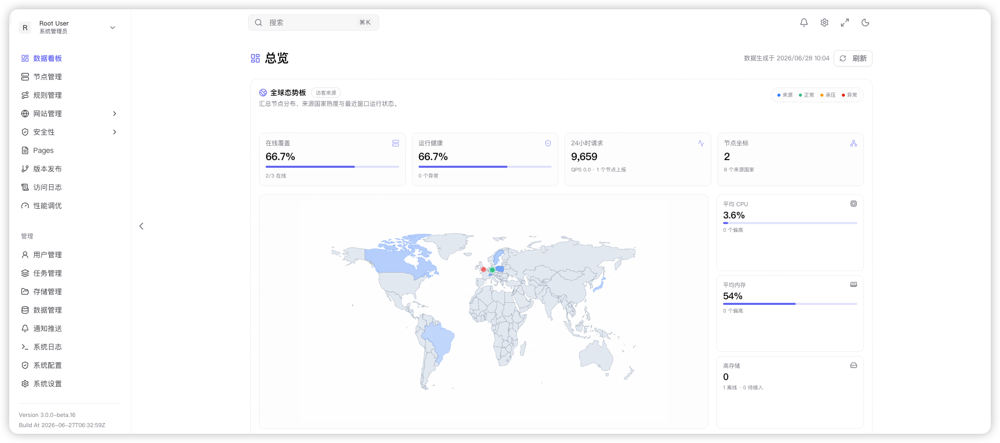
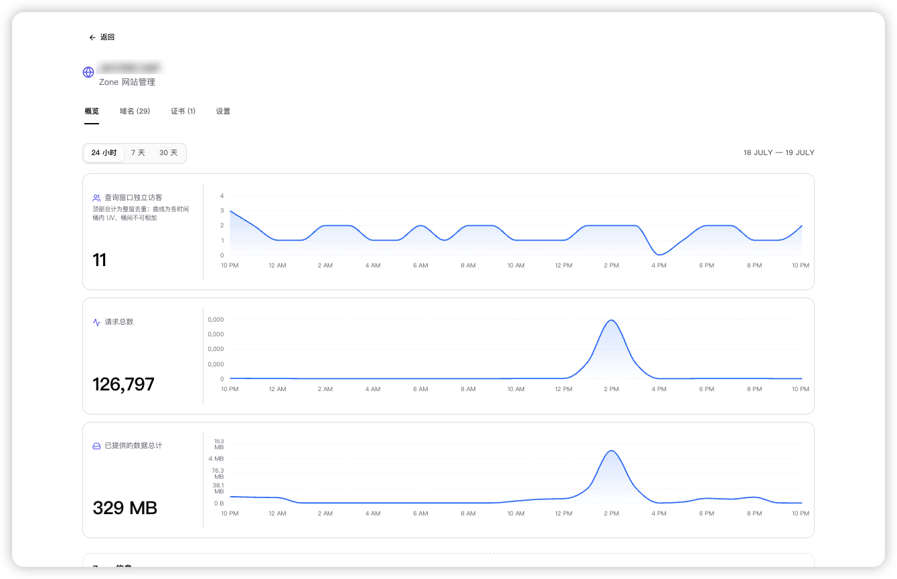
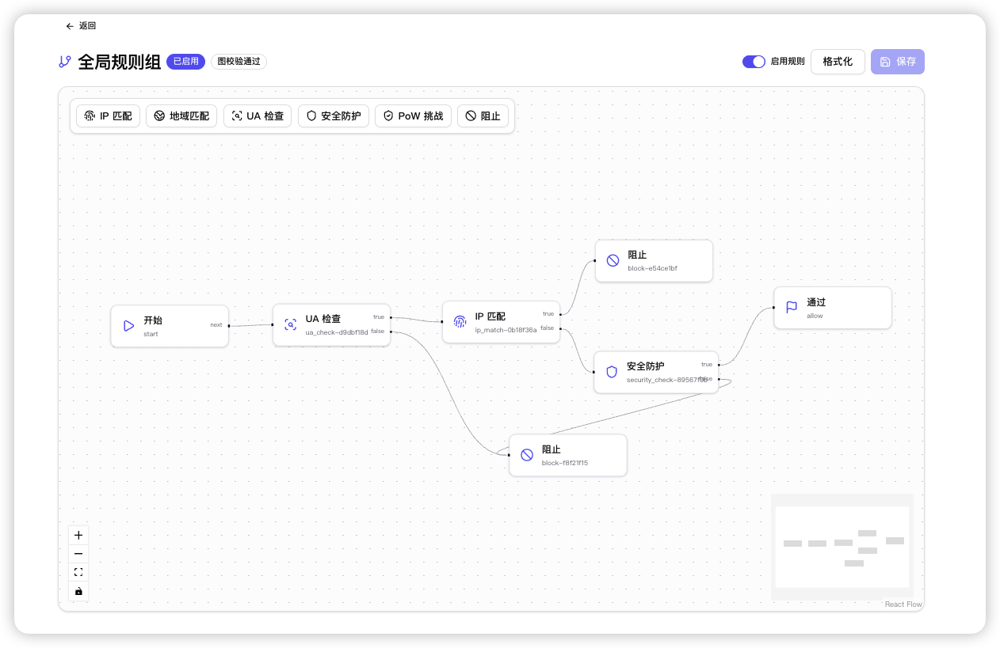

<div align="center">

# OpenFlare

**[English](./README.md) | [简体中文](./README.zh-CN.md)**

OpenFlare 是开源 CDN 编排与边缘安全平台。它支持反向代理、集中式配置同步、内网穿透（Tunnels）、动态 WAF 防护以及防 CC 挑战。

</div>

<p align="center">
  <a href="https://raw.githubusercontent.com/Rain-kl/OpenFlare/main/LICENSE">
    
  </a>
  <a href="https://github.com/Rain-kl/OpenFlare/releases/latest">
    
  </a>
  <a href="https://github.com/Rain-kl/OpenFlare/pkgs/container/openflare">
    
  </a>
</p>

> [!WARNING]
> 使用 `admin` 用户初次登录系统后，务必修改默认密码 `12345678`。
>
> BETA 版本为开发测试阶段的临时产物，可能存在未知问题，请勿在生产环境使用。

## 文档

**https://openflare.fyrn.link**

常用入口：

* [快速开始](https://openflare.fyrn.link/guide/quick-start)
* [部署说明](https://openflare.fyrn.link/deployment/deployment)
* [配置项参考](https://openflare.fyrn.link/reference/configuration)
* [系统设计](https://openflare.fyrn.link/design/)

## 核心能力

* **反代配置管理**：以网站规则为聚合边界，支持多域名绑定与多上游负载均衡，统一管理所有 OpenResty 节点的反代配置。
* **安全内网穿透（Tunnels）**：开源版的 Cloudflare Tunnels。无须公网 IP 或暴露入向端口，通过 Relay 中继节点与 OpenFlared 客户端安全反向穿透内网 Web 服务至公网。
* **边缘 WAF 安全防护**：提供全局与自定义规则组，支持手动/自动/订阅型 IP 组、MaxMind GeoIP 国家级地域准入、IP 组成员 Checksum 差分同步（无需 Nginx 重载）以及自定义拦截响应。
* **防 CC 与人机挑战（PoW）**：内置高性能客户端密码学 Proof of Work 挑战（类似 Turnstile），在网关边缘秒级拦截并阻断僵尸网络与爬虫。
* **Pages 静态托管**：支持上传或从受限 Remote URL、公开 GitHub Release asset 同步预构建产物；GitHub latest 可定时检查并可选自动发布。所有来源统一生成不可变部署，由边缘 Agent 拉取并通过 OpenResty 本地提供服务，支持回滚、SPA Fallback 与 API 反向代理。
* **TLS 证书自动化**：支持证书动态上传、多域名证书自动匹配绑定，以及通过 ACME 协议向 Let's Encrypt 自动申请与续期证书。
* **Uptime Kuma 监控同步**：与 Uptime Kuma 集成，自动差分同步监控站点列表，实时感知节点存活与服务可用状态。
* **SSO 单点登录**：支持 GitHub OAuth 与标准 OIDC 协议，无缝接入企业身份提供商实现统一登录。
* **统一观测**：聚合节点请求指标、实时访问日志明细、宿主机与 Nginx 资源快照、健康事件以及网络波动补传缓冲。

## 界面预览

### 仪表盘总览



### 访问日志



### WAF 防护



## 快速开始

### 硬件配置推荐

| 组件 | 最低硬件配额                        | 推荐硬件配额 | 说明 |
| --- |-------------------------------| --- | --- |
| **Server 控制面** | 1 核 CPU / 2 GB 内存 / 20 GB 磁盘  | 2 核 CPU / 4 GB 内存 / 50 GB+ 磁盘 | 磁盘用量需根据访问日志留存时长与并发流量合理扩容 |
| **Agent 数据面** | 1 核 CPU / 512 MB 内存 / 2 GB 磁盘 | 2 核 CPU / 2 GB 内存 / 10 GB+ 磁盘 | 根据 OpenResty 的并发代理连接量与 WAF 拦截处理扩容 |
| **Relay 中继节点**| 1 核 CPU / 1 GB 内存 / 5 GB 磁盘   | 2 核 CPU / 2 GB 内存 / 20 GB 磁盘 | frps 传输中继吞吐量主要受带宽与 CPU 吞吐能力限制 |
| **OpenFlared 客户端**| 1 核 CPU / 256 MB 内存 / 1 GB 磁盘 | 1 核 CPU / 512 MB 内存 / 5 GB 磁盘 | 独立运行于内网，自身资源占用极小，保障网络吞吐即可 |

### 1. 启动 Server

使用 docker-compose

```bash
# 下载环境变量模板并创建 .env 文件
curl -o .env.example https://raw.githubusercontent.com/Rain-kl/OpenFlare/refs/heads/main/.env.example
cp .env.example .env
```

```yaml
services:
  openflare:
    image: ghcr.io/rain-kl/openflare:latest
    restart: unless-stopped
    env_file: .env
    environment:
      TZ: ${TZ:-Asia/Shanghai}
    ports:
      - "3000:3000"
    volumes:
      - openflare_uploads:/app/uploads
    depends_on:
      postgres:
        condition: service_healthy
      redis:
        condition: service_healthy

  postgres:
    image: postgres:17-alpine
    restart: unless-stopped
    environment:
      POSTGRES_DB: ${DB_NAME:-openflare}
      POSTGRES_USER: ${DB_USERNAME:-openflare}
      POSTGRES_PASSWORD: ${DB_PASSWORD:-replace-with-strong-password}
    volumes:
      - openflare_postgres_data:/var/lib/postgresql/data
    healthcheck:
      test: ["CMD-SHELL", "pg_isready -U ${DB_USERNAME:-openflare} -d ${DB_NAME:-openflare}"]
      interval: 10s
      timeout: 5s
      retries: 5

  redis:
    image: valkey/valkey:8.0-alpine
    restart: unless-stopped
    command: ["valkey-server", "--appendonly", "yes"]
    volumes:
      - openflare_redis_data:/data
    healthcheck:
      test: ["CMD", "valkey-cli", "ping"]
      interval: 10s
      timeout: 5s
      retries: 5
      start_period: 5s

volumes:
    openflare_uploads:
    openflare_postgres_data:
    openflare_redis_data:
```

详细部署说明见 [部署文档](https://openflare.fyrn.link/deployment/deployment)。

访问地址：`http://localhost:3000`

默认账号：

* 用户名：`admin`
* 密码：`12345678`

### 2. 安装 Agent

安装 Agent 前请先在节点上安装 OpenResty，或改用内置 OpenResty 的 Agent Docker 镜像。

你可以在控制面板的节点管理->详情->节点信息->节点标识与部署复制安装命令，或直接使用下面的脚本：

#### Docker 部署

Docker 部署可直接运行 Agent 镜像：

```bash
docker pull ghcr.io/rain-kl/openflare-agent:latest
docker rm -f openflare-agent 2>/dev/null || true
docker run -d --name openflare-agent --restart unless-stopped \
  -p 80:80 -p 443:443/tcp -p 443:443/udp \
  -v openflare-agent-pages:/data/var/lib/openflare/pages \
  -e OPENFLARE_SERVER_URL=http://your-server:3000 \
  -e OPENFLARE_AGENT_TOKEN=YOUR_AGENT_TOKEN \
  ghcr.io/rain-kl/openflare-agent:latest
```

## Cordis / Wavelet 上游

OpenFlare 构建在 Wavelet Cordis 之上。克隆后请启用 `.gitattributes` 中的 `merge=ours`，这样 `git merge wavelet/main` 会保留 OpenFlare 自有路径：

```bash
git config include.path ../.gitconfig
# worktree 安全写法：
git config include.path "$(git rev-parse --show-toplevel)/.gitconfig"
```

`docker compose` 使用 `docker-compose.yaml`。`docker-compose.wavelet.yml` 是上游 Wavelet 编排，不是本产品的默认栈。镜像发布走 `.github/workflows/build-image-openflare*.yml`；Wavelet 的 `build-image.yml` 已隔离。

## 开源协议

本项目采用 [Apache License 2.0](./LICENSE) 开源。

## Star History

<a href="https://www.star-history.com/?repos=Rain-kl%2FOpenFlare&type=date&legend=bottom-right">
 <picture>
   <source media="(prefers-color-scheme: dark)" srcset="https://api.star-history.com/chart?repos=Rain-kl/OpenFlare&type=date&theme=dark&legend=top-left" />
   <source media="(prefers-color-scheme: light)" srcset="https://api.star-history.com/chart?repos=Rain-kl/OpenFlare&type=date&legend=top-left" />
   
 </picture>
</a>
