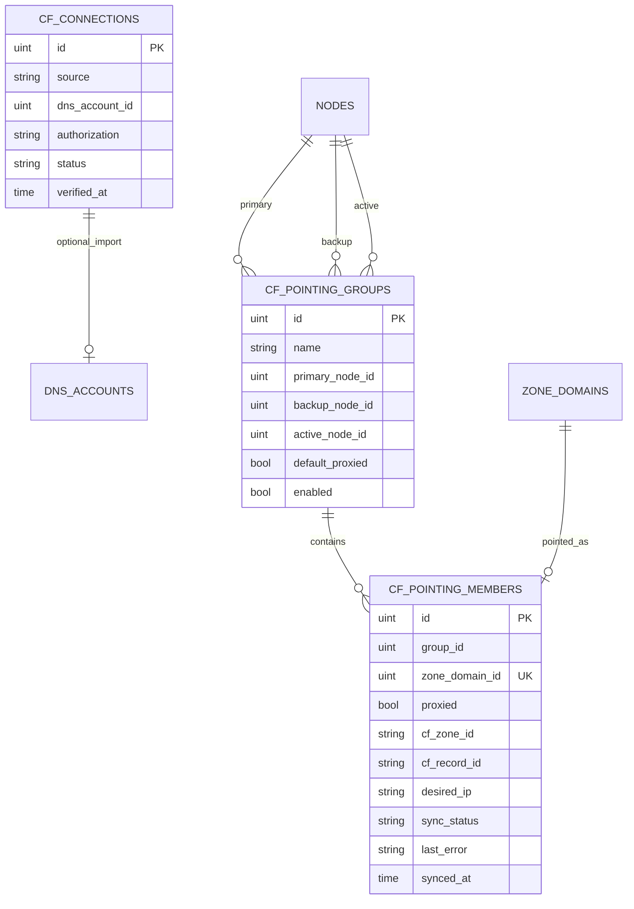

# Cloudflare DNS 指向设计

## 目标

通过 Cloudflare API 将 OpenFlare 中的 **ZoneDomain（明确 FQDN）** 快速指向边缘节点 IP，替代在 CF 控制台手工改 A 记录。用户以 **指向分组** 组织域名：每组配置主节点与备用节点、默认橙云策略；成员可单独覆盖橙云。系统以库表为期望状态，幂等同步远端 DNS。

本模块是 **可选对接能力**，不把 Zone 本身变成权威 DNS 控制面。Zone 仍只负责根域边界、域名、证书与反代关联；DNS A 记录的创建/更新/删除由本模块驱动 Cloudflare。

## 范围与分期

### 一期（本设计落地范围）

* 侧边栏 **Cloudflare** 入口与 Token 就绪门禁
* 连接配置：从现有 DNS 账号导入 **或** 模块内独立录入（混合来源），加密存储
* 指向分组 CRUD：主节点、备用节点（预留）、分组默认橙云
* 成员管理：以 `zone_domain_id` 为粒度加入/移出；成员级橙云
* 同步：将每个成员写成 Cloudflare 上 **单条 A 记录** → 当前生效节点 IPv4
* 触发：手动同步、加入成员、改节点/橙云、节点 IP 变更入队
* 异步任务批量同步；成员同步状态与可读错误

### 二期

* Agent 心跳离线判定主节点故障 → `active_node` 切至备用 → 整组自动同步
* 可选自动回切、故障通知推送

### 明确不做（更远或永久）

* 多 Cloudflare 账号并行（全局一份连接配置）
* AAAA / 多 A 负载 / CNAME 到节点主机名
* 管理 MX/TXT/Page Rules 等非本模块 A 记录
* 非 Cloudflare DNS 厂商
* 将 DNS 记录管理并入 Zone 核心模型

## 与现有能力的关系

| 现有能力 | 关系 |
| --- | --- |
| `of_zones` / `of_zone_domains` | 提供可指向的 FQDN 清单；本模块只引用 `zone_domain_id` |
| `of_nodes.ip` | A 记录 `content` 来源；建议限制 edge 节点且 IP 为合法 IPv4 |
| `of_dns_accounts` + `sealSensitive` | ACME DNS-01 已支持 Cloudflare Token；本模块可 **导入** 同一账号，也可独立存 Token |
| lego Cloudflare provider | **仅** TXT/DNS-01；本模块自建 CF HTTP 客户端做 Zone/DNS Record API |

## 核心模型

### `of_cf_connections`（全局一份有效连接）

| 字段 | 说明 |
| --- | --- |
| `source` | `dns_account` \| `standalone` |
| `dns_account_id` | `source=dns_account` 时关联 `of_dns_accounts`（type=cloudflare） |
| `authorization` | `source=standalone` 时加密存储，载荷形状 `{"api_token":"..."}`，与 DNS 账号一致；API **永不回传** |
| `status` / `verified_at` | 连通校验结果与时间 |

**Token 解析：** `dns_account` → 解密关联账号；`standalone` → 解密本行。关联账号删除或校验失败 → 模块未就绪，禁止同步。

**建议权限：** Cloudflare API Token 含 `Zone:Read`、`DNS:Edit`。

### `of_cf_pointing_groups`

| 字段 | 说明 |
| --- | --- |
| `name` | 展示名 |
| `primary_node_id` | 主节点 |
| `backup_node_id` | 备用（可空；一期仅存储） |
| `active_node_id` | 当前生效节点；一期等于 primary；二期 failover 改写 |
| `default_proxied` | 分组默认橙云；**仅影响新加入成员** |
| `enabled` | 是否参与同步 |

约束：主备不得为同一节点；选作生效目标的节点须有合法 IPv4。

### `of_cf_pointing_members`

| 字段 | 说明 |
| --- | --- |
| `group_id` | 所属分组 |
| `zone_domain_id` | 全局唯一：一域名最多在一个分组 |
| `proxied` | 成员橙云（运行时唯一依据） |
| `cf_zone_id` / `cf_record_id` | Cloudflare 缓存，用于幂等更新 |
| `desired_ip` / `sync_status` / `last_error` / `synced_at` | 期望与同步状态 |

`sync_status`：`pending` \| `syncing` \| `ok` \| `error`。

无物理外键；`zone_domain_id` 唯一索引；`group_id` 等查询索引。

## 橙云优先级

1. **成员 `proxied`**：同步时写入 CF 的唯一依据。
2. **分组 `default_proxied`**：成员 **加入时** 拷贝到 `proxied`。
3. 之后修改分组默认值 **不回写** 已有成员。

## 同步语义

### 期望状态

OpenFlare 库表为 Source of Truth。每个成员期望：

| 项 | 值 |
| --- | --- |
| type | `A` |
| name | ZoneDomain 的 FQDN |
| content | 分组 `active_node` 的 IPv4 |
| proxied | 成员 `proxied` |
| ttl | 橙云开启时由 CF 强制 Auto；关闭时使用统一默认（如 300） |

一期不写 AAAA。节点 IP 非合法 IPv4 → 该成员 `error`。

### 触发

| 触发 | 行为 |
| --- | --- |
| 手动同步（全部 / 组 / 成员） | reconcile |
| 成员加入 | 初始化 `proxied` 后入队同步 |
| 成员移出 / 删组 | 默认删除本模块管理的远端 A（可配置保留） |
| 改主节点 / active / 成员 proxied | 对应范围重新同步 |
| 节点 IP 变更（心跳或手动） | `active_node_id` 指向该节点的成员入队 |
| Token 未就绪 | 拒绝同步 |

一期不做定时全量对账。

### Reconcile（单成员，幂等）

1. 用 FQDN 注册根域解析 CF Zone，缓存 `cf_zone_id`。
2. 有 `cf_record_id` 则优先 Update；失效则按 `name+type=A` 列举。
3. **0 条** → Create；**恰好 1 条** → 接管并 Update；**多条** → 失败，提示用户在 CF 清理。
4. 写回 `cf_record_id`、`desired_ip`、`sync_status`、`synced_at` / `last_error`。
5. 限流时有限次退避重试。

**所有权：** 只管理本模块缓存或「唯一同名 A」接管的记录；不清空 Zone、不改其它类型记录。用户在 CF 控制台改动后，下次同步以 OpenFlare 期望覆盖。

### 执行载体

* 单条：可在请求路径同步。
* 整组 / 按节点批量：Asynq 任务（`cloudflare:sync_member` / `sync_group` / `sync_by_node`），`bootstrap` 注册。
* 同成员互斥，防止并发双写。
* 节点 IP 变更路径 **best-effort** 投递任务，不阻断心跳。

## API（管理端）

前缀：`/api/v1/d/cloudflare`，Session 管理员鉴权。包：`internal/apps/openflare/cloudflare/`；路由：`internal/router/v1/openflare/register_cloudflare.go`。

| 资源 | 方法与路径 |
| --- | --- |
| 连接 | `GET/PUT /connection`，`POST /connection/verify`，`POST /connection/clear` |
| 总览 | `GET /overview` |
| 分组 | `GET/POST /groups`，`GET /groups/:id`，`POST /groups/:id/update|delete|sync` |
| 成员 | `GET/POST /groups/:id/members`，`POST .../members/:memberId/update|remove|sync` |
| 可选域名 | `GET /domains/available` |

* 成功 `response.OK`；失败 `response.Abort*`；**永不**在 JSON 中返回 Token。
* Handler 与 `logics.go` 分离；CF 客户端以接口抽象便于替换。

## 前端

* 导航：`frontend/lib/navigation/openflare-nav.ts` 增加 **Cloudflare** → `/cloudflare`（建议放在网站管理组、DNS 账号附近）。
* 路由：
  * `/cloudflare`：总览；未就绪则引导配置
  * `/cloudflare/settings`：混合 Token 配置与测试连接
  * `/cloudflare/groups`、`/cloudflare/groups/[id]`：列表与详情（成员、橙云、同步）
* 服务：`frontend/lib/services/openflare/` 下独立 service，继承 `BaseService`。
* 页面遵循现有标题栏与组件拆分规范；危险操作二次确认。
* 必须可见的文案：同步覆盖本模块管理的 A；多条同名 A 需手动清理；移出默认删远端记录；一期无自动故障切换。

## 错误与安全

* 用户可见文案为模块内常量；内部错误打 `pkg/logger`。
* 典型：未配置 Token、Token 无效、节点无 IP、CF 无 Zone、同名多 A、限流。
* Token 仅服务端解密使用；响应与日志禁止明文 Token。

## 数据迁移

* goose 双方言（PG/SQLite）新建三张表；默认值与 Go 零值一致。

## 关键决策摘要

| 决策 | 结论 |
| --- | --- |
| 模块形态 | 独立 Cloudflare 指向模块，非 Zone 内嵌字段 |
| Token | 混合：DNS 账号导入或独立加密 |
| 域名粒度 | ZoneDomain（FQDN） |
| 记录形态 | 单 A → active 节点 IPv4 |
| 故障切换 | 二期；心跳离线；一期只存 backup/active |
| 橙云 | 成员级生效；分组默认仅初始化 |
| SoT | 库表期望状态驱动 CF |
