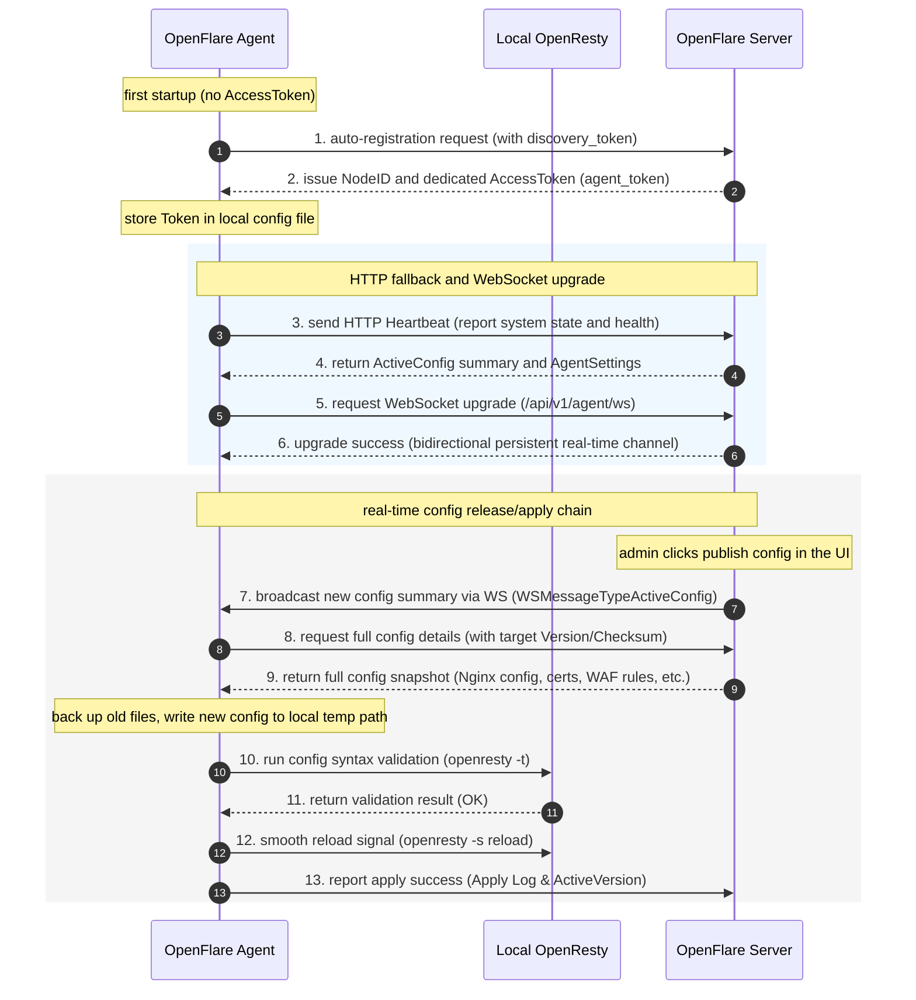
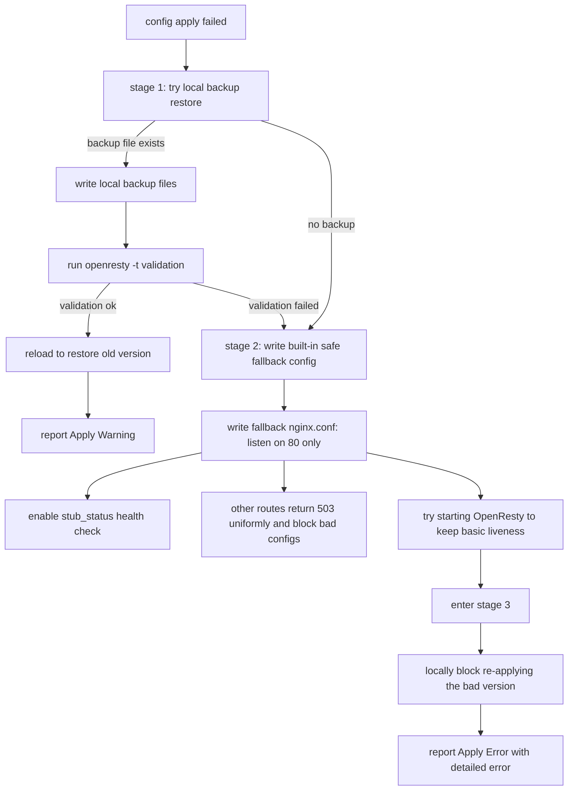

# Agent Design

You will learn: the Agent's design principles, core functional modules, interaction chain with the Server, and how the immutable version model and three-stage disaster recovery guarantee config-apply safety and reliability.

---

## Requirements Analysis

In distributed reverse-proxy and edge-security gateway scenarios, the Agent is the core bridge between the control plane (Server) and the data plane (OpenResty). Since the Agent runs on the user's actual node server, its design must satisfy these core security and HA requirements:

1. **Active pull (Pull model), not passive receive**: the Server doesn't hold node SSH keys and never initiates inbound connections to nodes. All control instructions and config updates are pulled upward by the Agent via heartbeat or WebSocket. This removes inbound-firewall security risks on nodes and prevents control-channel hijacking.
2. **Minimal invasiveness**: the Agent runs as a standalone Go binary, interacting with the local OpenResty process only via file-based config rewriting and signal notifications — no interference with other system services on the node.
3. **Strong disaster recovery and self-healing**: since network jitter, full disks, or bad configs can easily break config sync, the Agent must have zero-dependency local rollback self-healing to prevent one bad config from taking down the whole machine.
4. **Pure data and state landing**: the Agent only carries Server-rendered files and control intent to landing; it contains no complex business validation or multi-tenant auth — control-plane duties stay on the Server, keeping the node efficient and light.

---

## Core Features

The Agent mainly consists of these submodules cooperating for its full lifecycle:

| Module | Directory | Responsibility |
| :--- | :--- | :--- |
| **Config sync** | `sync/` | pull full config packages, write files, trigger reloads, record and report sync state. |
| **Heartbeat** | `heartbeat/` | periodically report node health, resource metrics, and fetch the latest active version summary. |
| **WebSocket** | `wsclient/` | keep a long connection to the Server for second-level real-time config push and control-plane instructions. |
| **OpenResty control** | `nginx/` | run Nginx config validation (`openresty -t`), rewriting, smooth reload, and process auto-start. |
| **Local state** | `state/` | persist local applied version, error logs, and buffered observability metrics not yet reported. |
| **Self-update** | `updater/` | listen for Server self-update instructions, safely fetch new binaries, and hot-upgrade in place. |
| **Observability** | `observability/` | collect host resource readings, OpenResty health/connections, and tail access-log details for reporting; **no** business pre-aggregation like UV/TopN/throughput. See [Edge Observability & Business Traffic Stats](./observability-design.md). |
| **GeoIP maintenance** | `geoipdata/` `geoipupdate/` | maintain and periodically update the local GeoIP DB for WAF geo filtering. |

---

## Interaction Chain with the Server

The Agent communicates with the control plane via **Token-based auto-registration** and **heartbeat/WebSocket dual channels** over its lifecycle.

### 1. Auto-Registration Flow
If `access_token` in the local `agent.json` is empty at startup but `discovery_token` is configured, auto-registration triggers:
1. The Agent sends a registration request to `/api/v1/agent/nodes/register` with local hardware summary, IP, and hostname.
2. The Server validates the `discovery_token`, generates a unique `NodeID` and dedicated `AccessToken` (i.e. `agent_token`), and returns them.
3. The Agent writes the dedicated Token into the local config file, erases the one-time `discovery_token`, and all future communication authenticates with the dedicated `AccessToken`.

### 2. Dual-Channel Heartbeat and Sync
* **HTTP polling channel (fallback & probe)**: the Agent POSTs heartbeats at the configured `heartbeat_interval` by default, reporting metrics while fetching the current active version summary (Version & Checksum).
* **WebSocket channel (real-time)**: after a successful HTTP heartbeat, the Agent auto-upgrades to WebSocket (`/api/v1/agent/ws`).
  * Once established, heartbeat and metric reporting fully move to the WS pipe, reducing network overhead.
  * When the Server releases/activates a new version, it broadcasts to Agents via WS. The Agent triggers sync **immediately** on the change event for second-level config effect.
  * If the WS link drops due to network issues, the Agent degrades to HTTP polling and retries WS with exponential backoff.

### 3. Interaction Sequence Diagram



---

## OpenResty Control

The Agent's control over the data-plane OpenResty forms an end-to-end loop: config landing, syntax validation, smooth reload, and abnormal-state capture.

### 1. Config File Landing Organization
After a successful sync, the Agent writes config under `data_dir` (default relative `etc/nginx/`, `etc/openflare/`, `var/lib/openflare/`; exact paths follow `main_config_path`, `route_config_path`, `cert_dir`, `lua_dir`, `runtime_config_dir`, `pages_dir` in `agent.json`):
* `nginx.conf`: the main config (replaces relevant placeholders, configures performance params, Shared Dictionaries, and the global Server).
* `conf.d/openflare_routes.conf`: the route config (generated by the Agent; contains all proxied sites' Server blocks, cert paths, cache, and rate-limit directives).
* `certs/`: certificate dir (files named `{cert_id}.crt` and `{cert_id}.key`).
* `lua/waf/` and `lua/pow/`: dedicated Lua runtime scripts for WAF and anti-CC challenges.
* `etc/openflare/waf_config.json` and `waf_ip_groups.json`: structured rule configs for the WAF filtering engine.
* `pages_dir`: the Pages static site deployment dir, default `data_dir/var/lib/openflare/pages`. When the active config references a Pages **project**, the Agent requests the control plane's「latest active package」(hash + package) by `project_id`, streams to a temp file with real response-size limits and SHA-256 validation, then safely extracts to `projects/{project_id}/releases/{hash}`. After extraction it rechecks file count and total bytes; absolute hard caps are 2 GiB package, 1,000 files, 8 GiB single-file/total. It then atomically switches `current` and **immediately deletes other historical releases of the same project** (only latest kept). Switching the active deployment within a project doesn't require republishing the main config; multi-project reconciliation isolates single-project failures.

### 2. Fine-Grained Reload Actions
1. **Back up current config**: before writing new files, copy existing config to a `.backup` temp dir, keeping a full scene snapshot.
2. **Write and replace placeholders**: write the latest template, replacing absolute-path placeholders (e.g. `__OPENFLARE_LUA_DIR__`, `__OPENFLARE_PAGES_DIR__`) with local actual runtime paths.
3. **Syntax validation**: run `openresty -t -c <temp_nginx.conf>` for strict syntax testing.
4. **Smooth reload**: on validation pass, move the new config to the formal path and run `openresty -s reload`. If OpenResty isn't started, start the process with the current config.
5. **Capture exceptions**: on validation/reload failure, the Agent captures command stdout/stderr as failure details for reporting.

---

## Release and Config Apply Model

OpenFlare uses an **immutable config version release model**, not online dynamic patching of node configs.

```text
modify rules -> preview / view diff -> release -> generate full config version -> activate version -> Agent pulls -> local apply -> report result
```

### 1. Core Design Principles
* **Full release**: each release compiles all enabled routes, certs, Pages deployment references, and global/local WAF rules on the control plane in one pass, generating a full version with a unique `checksum`.
* **Version format**: `YYYYMMDD-NNN` incrementing format for intuitive, monotonically increasing version history.
* **Globally single active version**: only one globally active config version exists at a time. Rollback doesn't reverse-patch; just set a historical healthy version to `active`, and Agents re-pull and apply it.

### 2. Three-Stage Disaster Recovery Rollback
When the Agent detects a config apply (or smooth reload) failure, it auto-activates this three-stage anti-outage chain:



1. **Stage 1: local backup fallback**
   * The Agent tries restoring the main config, routes, and certs from the previously saved `.backup` dir.
   * After writing backup files, re-run `openresty -t`. On success, reload back and report `Warning` to the Server (new version apply failed; auto-rolled back to the last healthy version).
2. **Stage 2: built-in safe fallback runtime**
   * If no local backup config exists (e.g. first deployment with a bad config), or the restored backup still fails validation, the Agent activates the final self-healing mechanism — writing the **built-in safe fallback config**.
   * **Safe fallback spec**:
     * listens only on port `80`, containing no user real reverse proxy routes.
     * Everything except the `/openflare/stub_status` health-check route (which returns normally) returns `503 Service Unavailable` with a fixed body `OpenFlare: No Valid Configuration`.
     * Tries starting OpenResty with this minimal config. This keeps the Nginx process itself alive, preserves the underlying health check/probe channel, prevents container/Pod restart loops from failed health checks, and protects sensitive routes.
3. **Stage 3: local config blocking**
   * The Agent records the crash-causing config `version + checksum` in a blocklist in the local state store.
   * Until the control plane activates a new config (`checksum` changes), the Agent heartbeat blocks re-pulling that bad version — preventing the "heartbeat → pull crash config → crash rollback" infinite loop.

### 3. WAF IP Group Runtime Async Sync
To avoid high-frequency malicious-IP blocklist changes constantly triggering full main-config releases and reloads (smooth reload still has slight CPU and connection overhead on Nginx), IP group members use an **async differential sync** decoupled from release versions:

* **Static release snapshot**: the released `waf_config.json` only contains rule groups' references to IP groups (`ip_whitelist_group_ids` / `ip_blacklist_group_ids`), not the concrete IP member lists.
* **Heartbeat differential comparison**: the Agent reports the MD5 Checksum map of locally cached IP groups in heartbeat packets.
* **Differential dispatch**: the Server compares the hashes of IP groups referenced by the current active version and only dispatches missing or changed members, written to the local `waf_ip_groups.json` for fast differential sync.
* **WebSocket real-time notification**: when the Server manually updates an IP group, a subscription source sync succeeds, or security rules auto-trigger temporary bans, the Server immediately broadcasts the affected IP group update via WebSocket; the Agent lands it instantly — **no Nginx reload** throughout.

---

## Design Constraints

To guarantee the security boundary of data and control channels, Agent code and secondary development must strictly follow:

1. **Zero privileged command channel**: the Server is absolutely forbidden from passing arbitrary shell commands or remote script execution (exec/eval, etc.) to the Agent. All system control primitives (start, stop, reload, update) must be hardcoded inside the Agent binary.
2. **Strict Token filtering and prefix validation**: when the Agent requests resources from the Server, endpoints are fixed under the `/api/v1/agent/` prefix and must carry `X-Agent-Token` for signature/token verification.
3. **Node autonomy**: the Agent must have complete offline capability. While disconnected from the Server, the local OpenResty must keep reverse-proxying normally based on locally landed config.
4. **Observability reports facts only**: access logs are reported as details; host metrics report counters/instant readings. Computing conclusion metrics like business UV, Top domains, or 24h data provided inside the Agent is forbidden (the Server aggregates). See [Edge Observability & Business Traffic Stats](./observability-design.md).
5. **Pages consumes only control-plane artifacts**: Remote URLs, GitHub Releases, the auto scanner, and future repo checkout/build executors are all Server responsibilities. The Agent receives no external URLs, access tokens, repo credentials, or clone/install/build commands — it only pulls already-activated deployment packages with integrity metadata.
