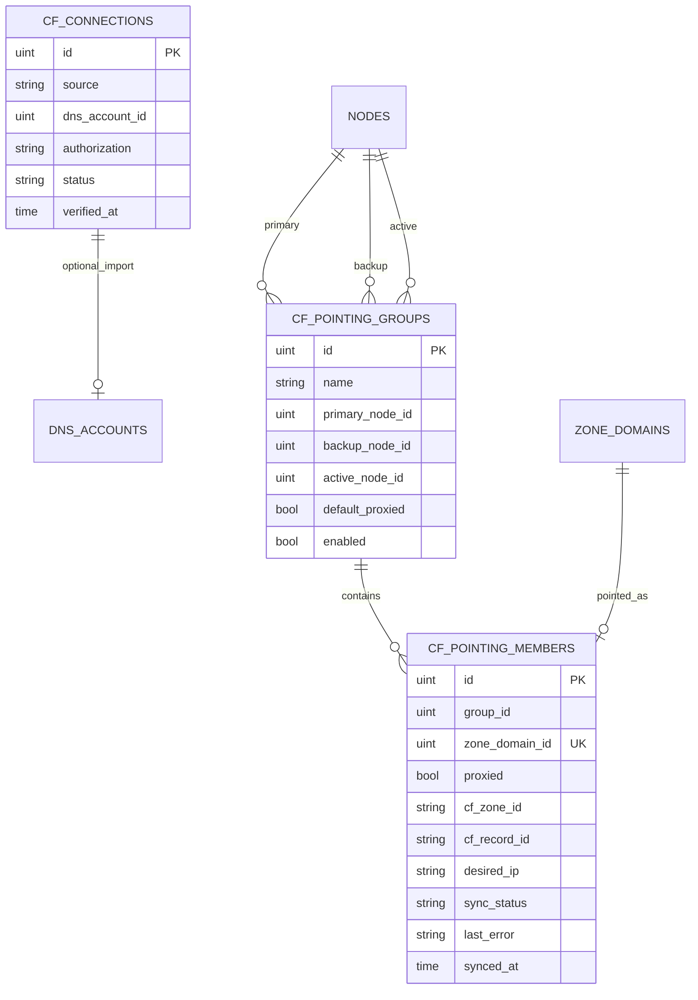

# Cloudflare DNS Pointing Design

## Goals

Point **ZoneDomains (explicit FQDNs)** in OpenFlare to edge node IPs quickly via the Cloudflare API, replacing manual A-record edits in the CF console. Users organize domains into **pointing groups**: each group configures a primary node, a backup node, and a default orange-cloud (proxied) policy; members can override orange-cloud individually. The system treats the database tables as the desired state and idempotently syncs remote DNS.

This module is an **optional integration capability**; it does not turn Zones into an authoritative DNS control plane. Zones still only handle root-domain boundaries, domains, certificates, and reverse-proxy associations; A record create/update/delete is driven by this module through Cloudflare.

## Scope and Phasing

### Phase 1 (this design's scope)

* Sidebar **Cloudflare** entry with a Token-ready gate
* Connection config: import from an existing DNS account **or** standalone entry within the module (mixed sources), stored encrypted
* Pointing group CRUD: primary node, backup node (reserved), group default orange-cloud
* Member management: add/remove at the granularity of `zone_domain_id`; member-level orange-cloud
* Sync: write each member as a **single A record** on Cloudflare → current active node IPv4
* Triggers: manual sync, member add, node/orange-cloud change, node IP change enqueue
* Async task batch sync; member sync status with readable errors

### Phase 2

* Agent heartbeat offline detection of primary node failure → `active_node` switches to backup → whole-group auto sync
* Optional auto failback, failure notification push

### Explicitly Out of Scope (later or permanent)

* Multiple parallel Cloudflare accounts (one global connection config)
* AAAA / multi-A load balancing / CNAME to node hostnames
* Managing MX/TXT/Page Rules and other non-module A records
* Non-Cloudflare DNS providers
* Merging DNS record management into the Zone core model

## Relationship with Existing Capabilities

| Existing Capability | Relationship |
| --- | --- |
| `of_zones` / `of_zone_domains` | Provide the pointable FQDN list; this module only references `zone_domain_id` |
| `of_nodes.ip` | Source of A record `content`; recommended to restrict to edge nodes with valid IPv4 |
| `of_dns_accounts` + `sealSensitive` | ACME DNS-01 already supports Cloudflare Token; this module can **import** the same account or store a Token standalone |
| lego Cloudflare provider | **Only** TXT/DNS-01; this module builds its own CF HTTP client for Zone/DNS Record APIs |

## Core Model

### `of_cf_connections` (one valid connection globally)

| Field | Description |
| --- | --- |
| `source` | `dns_account` \| `standalone` |
| `dns_account_id` | references `of_dns_accounts` (type=cloudflare) when `source=dns_account` |
| `authorization` | encrypted storage when `source=standalone`, payload shape `{"api_token":"..."}`, consistent with DNS accounts; the API **never returns it** |
| `status` / `verified_at` | connectivity check result and time |

**Token resolution:** `dns_account` → decrypt the associated account; `standalone` → decrypt this row. Associated account deleted or validation failed → module not ready, sync forbidden.

**Recommended permissions:** Cloudflare API Token with `Zone:Read`, `DNS:Edit`.

### `of_cf_pointing_groups`

| Field | Description |
| --- | --- |
| `name` | display name |
| `primary_node_id` | primary node |
| `backup_node_id` | backup (nullable; phase 1 stores only) |
| `active_node_id` | currently effective node; equals primary in phase 1; rewritten by phase 2 failover |
| `default_proxied` | group default orange-cloud; **only affects newly added members** |
| `enabled` | whether to participate in sync |

Constraints: primary and backup must not be the same node; the node chosen as the active target must have a valid IPv4.

### `of_cf_pointing_members`

| Field | Description |
| --- | --- |
| `group_id` | owning group |
| `zone_domain_id` | globally unique: one domain belongs to at most one group |
| `proxied` | member orange-cloud (the only runtime basis) |
| `cf_zone_id` / `cf_record_id` | Cloudflare cache for idempotent updates |
| `desired_ip` / `sync_status` / `last_error` / `synced_at` | desired and sync state |

`sync_status`: `pending` \| `syncing` \| `ok` \| `error`.

No physical foreign keys; `zone_domain_id` unique index; query indexes on `group_id` etc.

## Orange-Cloud Priority

1. **Member `proxied`**: the only basis written to CF during sync.
2. **Group `default_proxied`**: copied to `proxied` when a member is **added**.
3. Later changes to the group default **do not rewrite** existing members.

## Sync Semantics

### Desired State

The OpenFlare DB tables are the Source of Truth. Each member expects:

| Item | Value |
| --- | --- |
| type | `A` |
| name | the ZoneDomain's FQDN |
| content | the group `active_node`'s IPv4 |
| proxied | member `proxied` |
| ttl | forced Auto by CF when orange-cloud is on; unified default (e.g. 300) when off |

Phase 1 does not write AAAA. Node IP not a valid IPv4 → that member is `error`.

### Triggers

| Trigger | Behavior |
| --- | --- |
| Manual sync (all / group / member) | reconcile |
| Member added | initialize `proxied`, then enqueue sync |
| Member removed / group deleted | delete the remote A managed by this module by default (configurable keep) |
| Primary node / active / member `proxied` changed | re-sync the corresponding scope |
| Node IP changed (heartbeat or manual) | enqueue members whose `active_node_id` points to that node |
| Token not ready | refuse sync |

Phase 1 does not do scheduled full reconciliation.

### Reconcile (single member, idempotent)

1. Resolve the CF Zone by the FQDN's registrable root domain, cache `cf_zone_id`.
2. With a `cf_record_id`, prefer Update; if stale, list by `name+type=A`.
3. **0 records** → Create; **exactly 1** → take over and Update; **multiple** → fail and tell the user to clean up in CF.
4. Write back `cf_record_id`, `desired_ip`, `sync_status`, `synced_at` / `last_error`.
5. On rate limiting, retry with bounded backoff.

**Ownership:** only manage records cached by this module or taken over as "the only same-name A"; do not clear the Zone or touch other record types. After a user edits in the CF console, the next sync overwrites with the OpenFlare desired state.

### Execution Carrier

* Single record: can sync on the request path.
* Whole group / per-node batch: Asynq tasks (`cloudflare:sync_member` / `sync_group` / `sync_by_node`), registered in `bootstrap`.
* Per-member mutex to prevent concurrent double-writes.
* Node IP change path delivers tasks **best-effort**, not blocking the heartbeat.

## API (Admin Panel)

Prefix: `/api/v1/d/cloudflare`, Session admin auth. Package: `internal/apps/openflare/cloudflare/`; routes: `internal/router/v1/openflare/register_cloudflare.go`.

| Resource | Method & Path |
| --- | --- |
| Connection | `GET/PUT /connection`, `POST /connection/verify`, `POST /connection/clear` |
| Overview | `GET /overview` |
| Groups | `GET/POST /groups`, `GET /groups/:id`, `POST /groups/:id/update|delete|sync` |
| Members | `GET/POST /groups/:id/members`, `POST .../members/:memberId/update|remove|sync` |
| Available domains | `GET /domains/available` |

* Success `response.OK`; failure `response.Abort*`; the Token is **never** returned in JSON.
* Handlers separated from `logics.go`; the CF client is abstracted behind an interface for replaceability.

## Frontend

* Navigation: `frontend/lib/navigation/openflare-nav.ts` adds **Cloudflare** → `/cloudflare` (near Website Management / DNS Accounts).
* Routes:
  * `/cloudflare`: overview; guide to configure when not ready
  * `/cloudflare/settings`: mixed Token config and test connection
  * `/cloudflare/groups`, `/cloudflare/groups/[id]`: list and detail (members, orange-cloud, sync)
* Services: independent service under `frontend/lib/services/openflare/`, extending `BaseService`.
* Pages follow the existing title-bar and component-split conventions; destructive actions need double confirmation.
* Copy that must be visible: sync overwrites module-managed A records; multiple same-name A records need manual cleanup; removal deletes remote records by default; phase 1 has no automatic failover.

## Errors and Security

* User-visible copy is module-internal constants; internal errors log via `pkg/logger`.
* Typical: token not configured, invalid token, node without IP, no CF Zone, multiple same-name A records, rate limiting.
* Token is only decrypted server-side for use; responses and logs must never contain plaintext tokens.

## Data Migration

* goose both dialects (PG/SQLite) create the three tables; defaults match Go zero values.

## Key Decision Summary

| Decision | Conclusion |
| --- | --- |
| Module shape | standalone Cloudflare pointing module, not embedded Zone fields |
| Token | mixed: imported from DNS account or encrypted standalone |
| Domain granularity | ZoneDomain (FQDN) |
| Record shape | single A → active node IPv4 |
| Failover | phase 2; heartbeat offline; phase 1 only stores backup/active |
| Orange-cloud | member-level effective; group default only initializes |
| SoT | DB tables as desired state drive CF |
