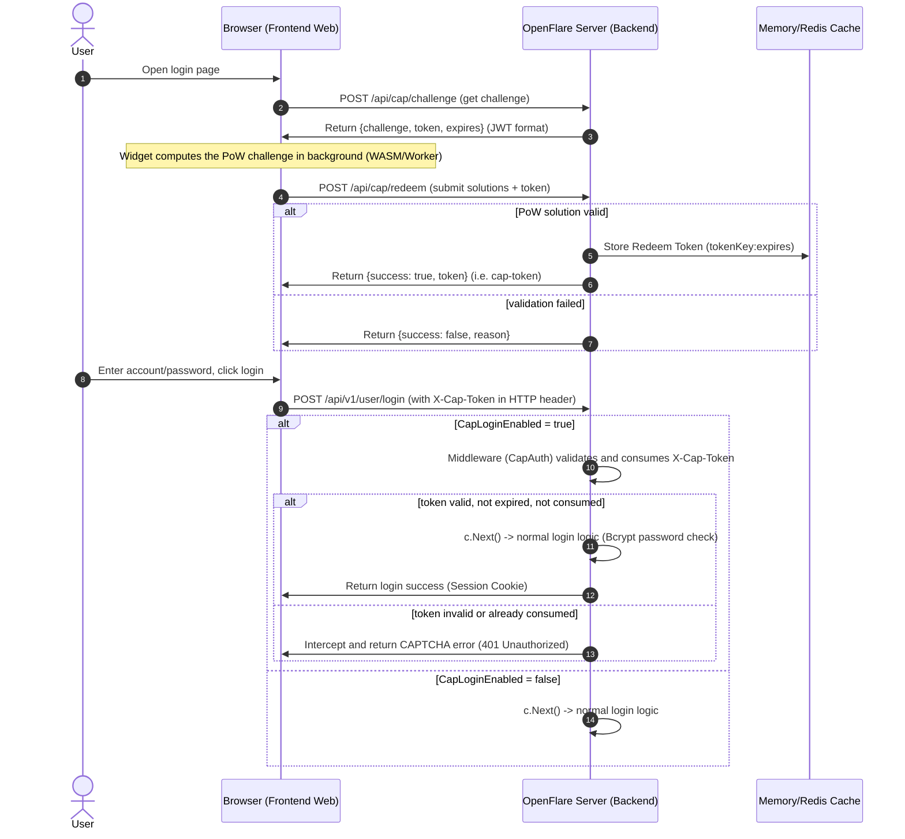

# Login CAPTCHA Integration (Cap)

This document describes the design of introducing **Cap** — an open-source CAPTCHA solution based on Proof-of-Work (PoW) and invisible browser fingerprint features — into the OpenFlare control plane, to protect the login API against brute-force attacks and credential-stuffing by crawlers.

---

## 1. Business Background and Product Scope

### Background and Pain Points
The OpenFlare login endpoint `/api/v1/user/login` lacks user-dimension protection; attackers can use proxy pools to perform credential stuffing and brute-force attacks on high-privilege accounts (such as `root`). At the same time, standard visual CAPTCHAs are unfriendly to login-page UX and accessibility.

### Product Scope and Technology Choice
* **Technology choice**: Cap (a Proof-of-Work-driven, invisible, image-free CAPTCHA solution).
  - **Core principle**: the client (Widget/page) obtains a proof-of-work (PoW) challenge from the server, computes the solution in the browser background, and sends the answer back. The server verifies the answer to complete human-machine verification.
  - **Advantages**: invisible, image-free, no dependency on external third-party API nodes (private), tiny package size.
* **Integration scope**: the control-plane Server login API (`/api/v1/user/login`) and the frontend login page.
* **Config granularity**: admins can toggle the CAPTCHA on/off anytime via the console Option table (`cap_login_enabled`).

---

## 2. System Architecture and Interaction Sequence

### 2.1 Module Responsibilities
1. **Frontend**:
   * Introduces the `cap-widget` (React 19 custom element) on the login page.
   * On form submit, accompanies the submission with the `cap-token` solved by the Widget.
2. **Server (control-plane backend)**:
   * Exposes `POST /api/cap/challenge` to distribute the PoW challenge and a signed JWT token to the client.
   * Exposes `POST /api/cap/redeem` to verify the submitted PoW solution and issue a login credential (Redeem Token) with an expiry time.
   * Stores the Redeem Token and its expiry in the in-memory/Redis cache.
   * In `POST /api/v1/user/login`, when CAPTCHA protection is enabled, first validates and consumes (single-use) the corresponding `cap-token`.

### 2.2 Verification Flow Sequence Diagram


---

## 3. Core APIs and Data Model

### 3.1 API Definitions

#### 1. Get Challenge (POST /api/cap/challenge)
* **Method**: `POST`
* **Auth**: public
* **Response payload** (unified API envelope, `data` is the business payload):
  ```json
  {
    "error_msg": "",
    "data": {
      "challenge": {
        "c": 1,
        "s": 32,
        "d": 4
      },
      "token": "eyJhbGciOiJIUzI1NiIsInR5cCI6IkpXVCJ9...",
      "expires": 1717660800000
    }
  }
  ```

#### 2. Redeem Challenge (POST /api/cap/redeem)
* **Method**: `POST`
* **Request payload**:
  ```json
  {
    "token": "challenge_jwt_token_here",
    "solutions": [12345, 67890, 54321]
  }
  ```
* **Response payload (success)**:
  ```json
  {
    "success": true,
    "token": "random_id:ver_token",
    "expires": 1717661000000
  }
  ```

#### 3. Login API (POST /api/v1/user/login)
* **Request payload unchanged**:
  ```json
  {
    "username": "root",
    "password": "your_password"
  }
  ```
* **CAPTCHA carrier**: placed in the HTTP Request Header `X-Cap-Token`.

---

## 4. Replay Attack Protection and Security Trade-offs
1. **JWT temporary state binding**: the challenge is signed into the JWT payload at generation time, including an expiry limit (10 minutes).
2. **Replay interception (nonce consumption)**: when the client calls `/redeem` to submit the solution, the backend marks the JWT signature as used in the cache. Re-submitting the same solution package returns `already_redeemed`.
3. **Redeem single-use (one-time invalidation)**: when the client logs in and submits the `cap-token`, the backend immediately deletes the key from the cache after validating it, preventing attackers from extracting historical valid `cap-token`s for login replay.
4. **Seamless verification**: by tuning parameters like `c` (challenge count) and `d` (difficulty), you balance solve time against anti-crawler strength; users solve silently in the background without interrupting the login flow.
