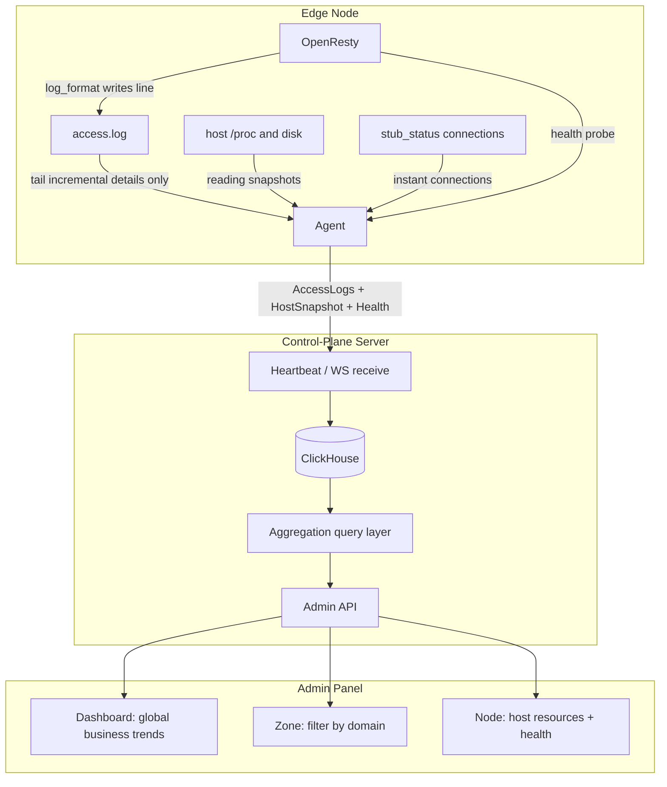

# Edge Observability and Business Traffic Statistics Refactor

You will learn: the problems this refactor solves (dashboard "OpenResty outbound" vs "Zone data provided" inconsistency, field and aggregation redundancy), and how the target architecture makes **the Agent report only facts and the Server interpret facts**, with access logs as the single source of truth for business traffic.

---

## 1. Goals

### 1.1 Problems to Solve

1. **Dual sources of truth**: business throughput comes from both access-log aggregation and OpenResty observability deltas, and the numbers never match long-term.
2. **Agent over-computes**: the edge pre-aggregates `TrafficReport`, throughput accumulation, and the control plane aggregates again — semantics are hard to evolve and reconcile.
3. **Field semantic overlap**: "OpenResty outbound" and "data provided" are the same business problem for users, but the system uses two field sets and two pipelines.
4. **Instant vs cumulative mixed**: 60-second window counts are treated as process cumulative values for 24h deltas, causing severe underestimation.
5. **UI induces wrong comparisons**: the dashboard and Zone page use similar "traffic/data" wording without declaring scope and caliber differences.

### 1.2 Refactor Goals

| Goal | Description |
| --- | --- |
| **Single business truth** | request count, data provided, UV, status distribution, Top domains etc. **only** derived from access logs (and Server-side rollups) |
| **Agent reports only facts** | detail logs + machine readings + health snapshots; **business UV/TopN/24h totals pre-aggregation is forbidden** |
| **Field convergence** | one business concept maps to one authoritative field; machine NIC and business delivery strictly separated by name |
| **Reconcilable** | global "data provided" ≈ sum of per-Zone "data provided" (difference only from unbound/unknown Hosts) |
| **Evolvable** | changing time windows, TopN, ownership rules only changes the Server, not the Agent |

### 1.3 Non-Goals (outside this design)

* Building a general log platform, full-log long-term archive, or search product.
* Replacing ClickHouse / removing the analytics DB dependency.
* Reworking Relay / OpenFlared host metric collection (principles align, but not in this round's protocol main path).
* Real-time streaming alert engine, APM tracing (the OpenTelemetry server side already exists and is orthogonal to this business traffic model).

---

## 2. Scope and Constraints

### 2.1 Product Constraints (inherited)

* Single-tenant, single globally active config; observability introduces no multi-tenant billing isolation.
* Access logs and time-series observability use the switchable log primary DB (ClickHouse by default; switchable to PostgreSQL/SQLite), see [Log Store Decoupling](./logstore.md).
* Agent has no inbound control, Pull model; during offline periods local OpenResty keeps serving, and observability can buffer locally and backfill.

### 2.2 Engineering Constraints

* Agent stays lightweight: parse log lines, read `/proc`, health checks; no business analysis.
* Control-plane API errors still use the unified envelope and `response.Abort*`.
* Access log field changes must update both the OpenResty `log_format` and the Agent parser simultaneously; Agent and control plane ship at the same version, no legacy protocol parsing.

---

## 3. Design Principles

### Principle P1: Agent Reports Facts, Server Interprets Facts

```text
Agent  = collection + reliable delivery (raw / near-raw)
Server = storage + aggregation + ownership + trends + reconciliation
```

**Allowed edge processing (collection)**

* Parsing JSON access.log lines into structured fields
* path length caps, dropping invalid lines, skipping observability-port's own requests
* Reading NIC/CPU/memory counters as **raw values**
* Batching, compression, offline buffering and retries

**Forbidden edge processing (business computation)**

* UV / Top domains / status histograms / window request_count as authoritative metrics
* Maintaining "business in/out cumulative" for the dashboard
* Zone / domain ownership stats, country distribution (country can be resolved at Server insert time)

### Principle P2: Single Truth for Business Traffic = Access Logs

| Business Question | Single Answer |
| --- | --- |
| How much data was provided | `sum(bytes_sent)` |
| How many requests | `count()` |
| How many unique visitors | `uniqExact(remote_addr)` (or product-defined hashing) |
| Status codes / Top domains | `group by` on logs |

### Principle P3: Three Metric Layers Never Mixed

| Layer | Name | Purpose | Typical Fields |
| --- | --- | --- | --- |
| L1 Business delivery | Business Traffic | user & Zone reconciliation, dashboard business trends | access log |
| L2 Edge health | Edge Health | is OpenResty alive, current connections | status, connections |
| L3 Host capacity | Host Capacity | capacity planning, is the machine saturated | CPU, memory, disk, **NIC** |

Never name L3 NIC or L2 instant counts as "data provided"; never draw L1 and L3 on the same summary card without labeling semantics.

### Principle P4: One Business Concept, One Field

* **Data provided** ≡ response body delivered ≡ "OpenResty outbound (business meaning)" in legacy copy → **keep only `bytes_sent` aggregation**
* **Data received** (optional) ≡ request-side volume → log `request_length` aggregation
* **Host outbound** ≡ `network_tx` delta, copy must include "host/NIC"

---

## 4. Pre-Refactor Problems (Baseline)

### 4.1 Pre-Refactor Data Flow (redundant)

```text
One HTTP request
  │
  ├─ access.log line
  │     → Agent tail → AccessLogs[]
  │     → CH of_node_access_logs
  │     → Zone "data provided" ✅
  │
  ├─ Lua shared dict window/cumulative counts
  │     → /openflare/observability
  │     → TrafficReport + OpenrestyObservation(rx/tx)
  │     → CH request_reports / obs_openresty
  │     → dashboard "OpenResty in/outbound" ❌ easily inconsistent with Zone
  │
  ├─ second access.log aggregation (fallback when observability endpoint fails)
  │     → yet another TrafficReport / throughput
  │
  └─ host network_rx/tx
        → Snapshot → "host" curve in network trends
```

### 4.2 Field Overlap

| User Perception | System Field A | System Field B | Problem |
| --- | --- | --- | --- |
| Outbound / provided | `openresty_tx_bytes` | `bytes_sent` | duplicate business semantics |
| Inbound | `openresty_rx_bytes` | `request_length` (log) | duplicate business semantics |
| Request count | `TrafficReport.request_count` | `count(access_logs)` | duplicate aggregation, window easily double-counted |
| Outbound (machine) | `network_tx_bytes` | (no business equivalent) | should be named separately, never reconciled with business |

### 4.3 Typical Failure Modes

1. Window counts treated as cumulative deltas → 24h business throughput severely underestimated.  
2. Hourly rollup `max−min` broken for resetting counters.  
3. Zone uses logs, dashboard uses observability → users think the system is wrong.  
4. Changing caliber requires syncing Lua, Agent state accumulation, Server deltas, and frontend copy.

---

## 5. Target Architecture

### 5.1 Target Data Flow



### 5.2 Responsibility Matrix

| Capability | Agent | Server | Frontend |
| --- | --- | --- | --- |
| Write access.log | OpenResty | — | — |
| Read and report details | ✅ | store | — |
| sum/count/uniq/TopN | ❌ | ✅ | display |
| Zone domain filtering | ❌ | ✅ | select Zone |
| Host CPU/memory/NIC | read raw values and report | delta/average | node/dashboard resource area |
| OpenResty connections | read instant and report | latest value | node health |
| Business 24h in/outbound | ❌ | log aggregation | uniformly called "data provided/received" |

---

## 6. Metrics and Field Model

### 6.1 Authoritative Field Table (target)

#### L1 Business Delivery (from access logs)

| Concept | Storage Field | Aggregation | Display Name |
| --- | --- | --- | --- |
| Request time | `logged_at` | window filter | — |
| Node | `node_id` | group | — |
| Client IP | `remote_addr` | `uniq` → UV | Unique visitors |
| Host | `host` | group / Zone mapping | Domain |
| Path | `path` | optional | — |
| Status code | `status_code` | group | Status distribution |
| **Data provided** | **`bytes_sent`** | **`sum`** | **Data provided** |
| **Data received** | **`request_length`** | **`sum`** | **Data received** (optional display) |
| Region | `region` (resolved & written by Server) | group | Source region |

> Note: the JSON key in the OpenResty `log_format` may keep the name `bytes_sent`; the value must come from **`$body_bytes_sent`** (consistent with production), representing response body delivered, i.e. "data provided".

#### L2 Edge Health (instant; no 24h business totals)

| Concept | Field | Description |
| --- | --- | --- |
| OpenResty health | `openresty_status` / message | existing |
| Current connections | `openresty_connections` | stub_status |
| (optional) rough recent-window QPS | node detail "right now" only, **never** authoritative 24h totals | if implemented must be labeled "instant" |

#### L3 Host Capacity

| Concept | Field | Display Name |
| --- | --- | --- |
| CPU / memory / disk usage | `host_metrics` | keep |
| NIC cumulative bytes | `network_rx_bytes` / `network_tx_bytes` | **Host NIC in/outbound** |
| Disk IO cumulative | `disk_read_bytes` / `disk_write_bytes` | Disk read/write |

### 6.2 Removed Fields (no compatibility layer)

| Original Field | Disposition | Reason |
| --- | --- | --- |
| `openresty_tx_bytes` / `openresty_rx_bytes` | **removed** | business bytes follow access logs |
| `TrafficReport` and TopN/window UV | **removed** | edge pre-aggregation |
| Agent state business lifetime accumulators | removed | violates P1 |
| Lua shared dict business throughput/window request counts | removed | not the delivery main path |

### 6.3 Naming Reference (frontend copy enforced)

| Forbidden Copy | Correct Copy | Data Source |
| --- | --- | --- |
| OpenResty outbound (business volume) | **Data provided** | `sum(bytes_sent)` |
| OpenResty inbound (business volume) | **Data received** | `sum(request_length)` |
| Network outbound (unspecified) | **Host NIC outbound** | `network_tx` delta |
| Two cards: data provided vs outbound | **keep only one business card** | logs |

---

## 7. Agent Design

### 7.1 Heartbeat Payload (target protocol)

Keep and strengthen:

```text
NodePayload
  identity / version / openresty_status / openresty_message  # latest state → PG
  profile                  # host overview (low frequency)
  host_metrics             # L3 resource readings (incl. NIC cumulative raw values)
  edge_health              # L2: status + connections (CH time series; message not in CH)
  access_logs[]            # L1 details (main path)
  health_events[]
  buffered[]               # buffered facts above, not reports
  waf_ip_group_checksums
```

Removed from the protocol (no compatibility layer):

```text
traffic_report
openresty_observation
snapshot / buffered_observability aliases
```

### 7.2 Access Log Reporting Requirements

Each detail at minimum contains:

| Field | Required | Note |
| --- | --- | --- |
| `logged_at_unix` | ✅ | request completion time |
| `remote_addr` | ✅ | UV |
| `host` | ✅ | Zone mapping |
| `path` | ✅ | may be truncated |
| `status_code` | ✅ | |
| `bytes_sent` | ✅ | body bytes, data provided |
| `request_length` | ✅ | data received |

Agent responsibilities:

1. Tail `access.log` by offset (reset offset on truncation/rotation, **only report new lines still present in the file**).  
2. Parse into structured form, batch into heartbeat / WS.  
3. Offline writes to local buffer, backfill by window once connected.  
4. **No sum/count/uniq on details.**

### 7.3 Host Snapshot

* Keep reporting NIC/disk **cumulative counter raw values** (not business pre-aggregation).  
* Server does non-negative deltas between adjacent samples → host trends.  
* This is unrelated to "data provided"; the UI must display it in a separate section.

### 7.4 OpenResty Local Observability

Converged state:

* Keep: health checks, `stub_status` current connections.  
* The main path no longer relies on `log.lua` shared dict business counts; `/openflare/observability` only returns health and connection snapshots, not business report sources.

### 7.5 Relationship with the Agent Design Doc

This design strengthens "pure data landing" in [Agent & Publish Model](./agent-design.md):

* Config and certificates: land and report applied state.  
* Observability: only carry facts, not business conclusions.

---

## 8. Server Design

### 8.1 Storage

| Input | Table | Description |
| --- | --- | --- |
| `access_logs[]` | `of_node_access_logs` | authoritative business details |
| `host_metrics` | `of_node_metric_snapshots` | L3; NIC/disk cumulative |
| `openresty_status` / `openresty_message` | **PG node table** | L2 **latest-state authority** (message only here) |
| `edge_health` | `of_node_edge_health` | L2 time series: status + connections (**no message**) |

GeoIP: continue resolving `remote_addr` → `region` in the Server insert path, not in the Agent.

### 8.2 Aggregation Layer (unified)

All business trends and Zone stats share the same query semantics:

```text
filter: logged_at ∈ [since, until]
optional: node_id / host IN (...)
metrics:
  request_count     = count()
  unique_visitors   = uniqExact(remote_addr)
  bytes_provided    = sum(bytes_sent)      -- data provided
  bytes_received    = sum(request_length)  -- data received
  series folded by hour/bucket
  distributions by status_code / host / region
```

Implementation locations:

* Zone: `GET .../zones/:id/stats` (existing, align field naming)  
* Dashboard: overview traffic / business network trends **switch to the same aggregation** (global, no host filter or Top filter)  
* Node detail: business volume = the same aggregation filtered by that `node_id`; host NIC still uses metric deltas  

### 8.3 Derived Rollups (optional performance path)

When detail queries over all nodes for 24h are too heavy, allow **Server-side** materialized views:

```text
of_access_log_hourly
  (hour, node_id, host, request_count, bytes_sent, bytes_received, ...)
```

Constraints:

* Derived only by CH from `of_node_access_logs`; **Agent is forbidden from writing this table directly**.  
* Zone / dashboard prefer reading the rollup, falling back to details (similar to the existing metric hourly policy).

### 8.4 Decommissioned Analytics Paths

| Path | After Migration |
| --- | --- |
| `BuildNetworkTrendPoints` delta on openresty_rx/tx | deleted, or keep only `network_*` host curves |
| `of_node_obs_openresty` throughput fields | stop writing; drop table or shrink columns after TTL expiry |
| `of_node_request_reports` + traffic hourly | business trends no longer depend on it; table can be deprecated wholesale |
| Dashboard compact openresty_tx series | change to bytes_provided series |

---

## 9. API and Frontend

### 9.1 Semantically Unified Response Fields

Business stats APIs should uniformly use:

```json
{
  "request_count": 0,
  "unique_visitors": 0,
  "bytes_provided": 0,
  "bytes_received": 0,
  "series": [
    {
      "bucket_started_at": "...",
      "request_count": 0,
      "unique_visitors": 0,
      "bytes_provided": 0,
      "bytes_received": 0
    }
  ]
}
```

API business byte fields use `bytes_provided` / `bytes_received` (access-log aggregation); no more openresty throughput aliases.

### 9.2 Dashboard

* **Business area**: request trend, data provided, data received (optional), status codes, Top domains, source regions — all L1.  
* **Resource area**: CPU/memory, **host NIC**, disk IO — all L3.  
* **Forbidden**: showing "OpenResty in/outbound" in the business area as a metric reconciled with Zone.

Suggest splitting or retitling "24-hour network and disk trends":

* "24-hour business traffic" → `bytes_provided` / `bytes_received` / requests  
* "24-hour host network and disk" → `network_*` / `disk_*`

### 9.3 Zone `/websites/:id`

* Keep cards like "total data provided".  
* Data and the dashboard business area use **the same aggregation function**, only `hosts = zone domain list`.  
* Docs and UI may note: the global dashboard includes all Hosts; this page is only this Zone.

### 9.4 Node Detail

* Business throughput: that node's `sum(bytes_sent)` etc.  
* OpenResty: health + current connections.  
* NIC: clearly "host".

---

## 10. OpenResty and Log Format

### 10.1 Keep

Existing JSON `log_format` core fields:

```text
ts, host, path, remote_addr, status, request_time,
bytes_sent (= $body_bytes_sent), request_length
```

### 10.2 Changes

* No longer rely on log-phase writes of business shared dict counts as control-plane input.  
* Observability-port requests continue not writing business stats (or `access_log off`).

### 10.3 Agent Parsing

* Protocol `NodeAccessLog` adds `request_length`.  
* Legacy log lines missing fields default to 0, not blocking the whole batch.

---

## 11. Upgrade and Migration (no compatibility layer)

### 11.1 Phase Review (shipped)

| Phase | Content |
| --- | --- |
| **M1–M5** | read path switches to access logs; protocol v2; stop pre-aggregation; edge_health + access_log_hourly; drop old tables and API compat fields |

### 11.2 Upgrade Strategy

* **Agent: destroy-and-recreate preferred**; binary replacement allowed.  
* On binary replacement: the local old observability buffer (including `snapshot` / `openresty_observation` / `traffic_report`) is **deleted wholesale**, rebuilt after running.  
* Server **does not** parse v1 fields, **does not** dual-read request_reports / openresty throughput.  
* Detail-missing periods: business charts are empty or partial; **never** impersonate data provided with NIC or removed openresty throughput.

### 11.3 Data Backfill

* Historical "data provided" follows access logs.  
* Before `of_access_log_hourly` is created, history is backfilled with goose SQL (ANTI JOIN to prevent duplicates).

### 11.4 Health-State Authority

* **Current state**: PG `openresty_status` / `openresty_message`.  
* **Time series**: log primary DB `of_node_edge_health` (status + connections; no message).

### 11.5 UV

* **Whole-window unique visitors**: `uniqExact(remote_addr)` (dashboard totals, Zone totals).  
* **Bucketed UV** (Zone curves): per-bucket uniq, **not summable across buckets**; UI must note it.  
* **Hourly trend path**: don't plot / fill per-hour UV (hourly table has no UV).

---

## 12. Storage and Capacity

* Business trends rely on details or hourly rollups; watch `of_node_access_logs` TTL and sampling.  
* If details are too large: prefer **Server-side rollup** rather than restoring Agent pre-aggregation.  
* For high-cardinality path scenarios, limit detail path length (existing); aggregation doesn't do global Top over full paths by default.

---

## 13. Risks and Trade-offs

| Risk | Mitigation |
| --- | --- |
| Large detail volume makes CH and heartbeat heavy | batching, compression, sampling policy evaluation; Server rollup; limit per-batch count |
| Brief log loss lowers business volume | local buffer and rotation handling; monitor access log collection lag |
| Users still compare "NIC outbound" with "data provided" | UI sections and copy enforce the "host" prefix |
| Old Agents stay online long-term | **no compatibility layer**; Agents must be upgraded/rebuilt |

**Why not keep Agent pre-aggregation as an optimization?**

* Saving bandwidth re-splits the truth, drifts calibers, and repeats this problem.  
* Optimization belongs in Server derived tables and queries, not edge business computation.

---

## 14. Key Decision Summary

| Decision | Choice | Rejected Alternative |
| --- | --- | --- |
| Business traffic truth | access logs | OpenResty dict / TrafficReport |
| Agent role | report only facts | edge UV/TopN/throughput accumulation |
| "Outbound" vs "provided" | merged into data provided | dual fields and dual pipelines long-term |
| NIC traffic | independent L3, separate copy | reconciled side-by-side with business outbound |
| Performance | CH rollup | Agent pre-aggregation |
| Migration | switch read path first, then slim Agent | drop details first, rely on pre-aggregation |

---

## 15. Doc and Code Mapping

| Area | Main Paths |
| --- | --- |
| Protocol | `pkg/protocol/agent.go` |
| Agent collection | `internal/apps/agent/observability/`, `heartbeat/` |
| OpenResty logging and Lua | `pkg/render/openresty/`, `internal/apps/agent/nginx/observability_assets.go` |
| Server storage | `internal/apps/openflare/agent/observability.go` |
| Log aggregation | `internal/repository/analytics/node_access_log*.go`, `internal/apps/openflare/zone/stats.go` |
| Dashboard | `internal/apps/openflare/dashboard/`, `internal/apps/openflare/observability/analytics.go` |
| Frontend | `frontend/app/(main)/page.tsx`, `components/dashboard/*`, `websites/.../zone-overview.tsx` |

**Recommended reading order:**

1. **[Observability Transport Model](./observability-transport-model.md)** (latest: what to send, where collected from, frequency, sample JSON)  
2. [Agent Reporting Protocol and Observability Data Model](./observability-data-model.md) (protocol fields and DDL)

---

## 16. Revision History

| Date | Notes |
| --- | --- |
| 2026-07-17 | initial draft: target architecture and migration phases for dual truth, Agent pre-aggregation, field redundancy |
| 2026-07-17 | added protocol/table-structure chapter links `observability-data-model.md` |
