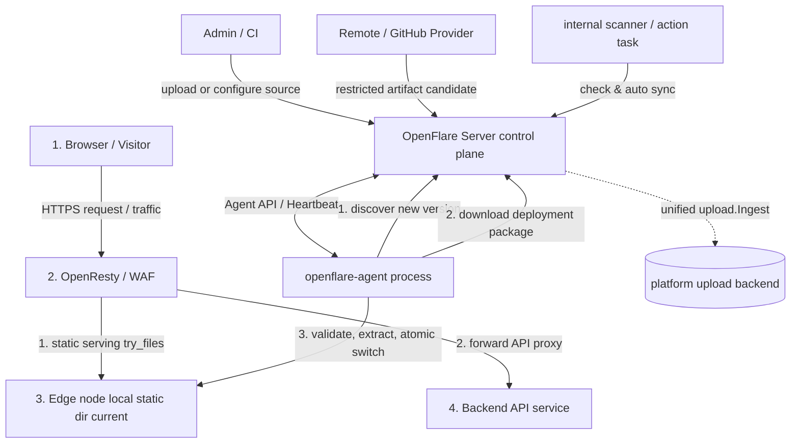

# Pages Static Hosting Design

You will learn: the architecture design of OpenFlare Pages static hosting, the immutable deployment and secure extraction flow, the OpenResty static serving and API reverse proxy config rendering, and the cooperative workflow between the control plane and the Agent.

---

## Requirements Analysis

In modern web operations, besides reverse proxying dynamic applications, deploying and hosting static frontend sites (SPA apps built with React/Vue, or static generator output like Hugo/VitePress) is extremely common. Traditional approaches suffer from:
1. **Release disconnected from proxy config**: after uploading frontend build artifacts to the Nginx host, you still need to modify the Nginx vhost config manually or via other scripts — error-prone and without version control.
2. **Multi-node distribution is hard**: with multiple edge nodes managed by the control plane, syncing static files to all nodes consistently requires complex sync scripts (e.g. rsync).
3. **Rollback lacks consistency**: once a new frontend package fails or has serious defects, you must restore both the static files and the proxy rules — atomic rollback is hard.

To solve these, OpenFlare introduces **Pages static hosting**, inspired by Cloudflare Pages. It brings "pre-built artifact import" and "website proxy rule config" into the same control plane, leveraging OpenFlare's pull-based cooperative architecture to achieve eventual convergence across multiple Agents via immutable deployments, single-node atomic switching, and periodic reconciliation, with fast rollback.

---

## Core Features

The Pages static hosting subsystem includes:
* **Pre-built artifact deployment**: upload a static resource archive directly, or save a Remote URL or public GitHub Release asset source for a project. External sources are only accessed by the Server; on successful sync they uniformly create or reuse an immutable deployment and activate it atomically.
* **Immutable deployment snapshots**: each local upload creates a new candidate deployment; persistent-source sync creates or reuses a deployment by source identity/revision and activates it. All deployments have a unique ID and whole-package SHA-256, support keeping the most recent N historical versions per system config, and can be rolled back anytime.
* **Check and auto-update**: GitHub latest can be checked periodically per project; by default it only hints at available updates; only after an admin explicitly enables it does it auto-sync and publish by the exact revision found.
* **SPA Fallback**: supports fallback routing for single-page apps; when a static file isn't found, requests redirect to the entry file.
* **Built-in API reverse proxy**: enables API proxying within Pages rules with one click, eliminating cross-origin issues by forwarding requests to a designated backend.
* **Secure package validation and extraction**: built-in path-traversal defense, symlink-hijack protection, file size/count limits, and configurable upload package size control to keep nodes physically safe.
* **Configurable limits**: admins can adjust the "deployment package size limit" and "historical deployment retention" in ops settings.

### Deployment Sources

Projects currently support three source views: manual, Remote URL, and GitHub Release. No source record means manual; switching or deleting a source doesn't delete historical deployments or change the current active deployment. Remote URL only allows manual "Sync and Publish"; GitHub Release supports manual check/sync for latest/tag, and only latest can opt into scheduled checking and auto-update.

A source is mutable config; a deployment is an immutable fact. Source config and runtime cursor/state/lease are stored separately; deployments only save the security provenance snapshot at creation time. All artifacts reuse the "download or receive artifact → real-byte and entry validation → `upload.Ingest` → deployment" artifact pipeline: manual uploads stop at candidate, waiting for explicit admin activation; persistent-source sync creates-or-loads and atomically activates in the same business transaction.

The admin project detail is organized as "current production deployment → deployment source → deployment history".

---

## Pages Static Hosting Architecture

Pages hosting is logically split into a **Control Plane** and a **Data Plane**.



* **Control Plane**: the Server receives local uploads or fetches Remote/GitHub pre-built artifacts via restricted providers; action tasks and the internal scanner handle checking, syncing, and auto-updates. All artifacts pass unified inspection and `upload.Ingest` into the platform storage backend; manual uploads create a new candidate, persistent-source sync creates-or-loads a deployment and activates it atomically. Config release only compiles the stable project anchor and static serving metadata.
* **Data Plane**: the Agent discovers Pages projects referenced by config during heartbeat/WS reconciliation, pulls the project's currently active package via a dedicated API, and performs validation and extraction. OpenResty serves static files locally; the Agent doesn't know whether the artifact came from upload, Remote, or GitHub.

---

## Data Model and Metadata Design

### 1. Core DB Entities
* **Pages project (`of_pages_projects`)**:
  * Records the business name, Slug (URL-friendly), enabled state, static serving root dir (RootDir, nullable), entry filename (EntryFile, default `index.html`), SPA Fallback settings, and API reverse proxy config (APIProxyPath, APIProxyPass, APIProxyRewrite).
* **Source config (`of_pages_project_sources`)**:
  * At most one mutable source config per project, distinguishing Remote URL and GitHub Release by `source_type`. `config_version` fences stale tasks; the full Remote URL lives only in the config table — never in responses, logs, task payloads, or deployment provenance. V2 does not promise DB column encryption.
* **Source runtime (`of_pages_project_source_runtime`)**:
  * 1:1 with the source, storing ETag, seen/applied revision, last check/sync, next check, errors, and lease. State is fixed to `idle | checking | update_available | syncing | failed | attention`; queued/completed state is carried by `TaskExecution`.
* **Pages deployment (`of_pages_deployments`)**:
  * Records immutable deployment facts: project-incremental deployment number, whole-package SHA-256, `upload_id`, file count/total bytes, creator, and nullable source identity/revision, source security snapshot, and trigger. `artifact_path` is only a legacy-compat field and is no longer the storage truth for new deployments.
* **Deployment file manifest (`of_pages_deployment_files`)**:
  * Stores the full regular-file path list and actual byte counts per deployment for console display and statistics.
  * No longer computes content hashes per file; integrity is guaranteed by the **whole-package** SHA-256 (`of_pages_deployments.checksum`), verified by the Agent when pulling.
  * Control-plane inspection reads the archive via file handles, streaming each regular file body and checking declared vs actual size — no whole-package `ReadFile` into memory, no per-file disk write for hashing.

### 2. Route Association and Snapshot
`proxy_routes` rules associate with a Pages project via `upstream_type = "pages"` and `pages_project_id`. A route may join the release flow only when its type is `pages` and the project has an activated deployment.
The version snapshot emitted at release includes `snapshotPagesDeployment`:
```json
{
  "project_id": 1,
  "project_slug": "my-spa-app",
  "deployment_id": 12,
  "deployment_number": 3,
  "checksum": "a7b3c2...",
  "entry_file": "index.html",
  "spa_fallback_enabled": true,
  "spa_fallback_path": "/index.html",
  "api_proxy_enabled": true,
  "api_proxy_path": "/api",
  "api_proxy_pass": "http://api.internal:8000",
  "api_proxy_rewrite": "/api/(.*) /$1",
  "local_root": "__OPENFLARE_PAGES_DIR__/projects/1/current"
}
```

### 3. Dual-Track Relationship with the Main Config Version (project anchor + latest pull)
* The **main config version** and **Pages deployments** are two independent version systems.
* The stable anchor of a Pages route in the main config is **`pages_project_id` (project ID)**, not a deployment ID.
* The OpenResty `root` uses the project-level path `__OPENFLARE_PAGES_DIR__/projects/{project_id}/current`; the path stays unchanged on activation switch, so swapping packages never requires republishing the main config.
* The Agent requests the "latest active package" per project (like `github/release/latest`):
  * `GET /api/v1/agent/pages/projects/:project_id/latest/hash`
  * `GET /api/v1/agent/pages/projects/:project_id/latest/package`
  * The control plane returns the deployment ID, hash, package size, and expanded manifest metadata for the project's **currently active deployment**. The Agent uses the deployment ID and other latest metadata to detect pointer races during download, but the stable anchor of the main config and local dir remains the project ID.
* Therefore: switching the active deployment within a project **does not require publishing the main config**; the Agent polls the latest hash during periodic reconciliation, downloads on change, and switches `current`.
* The `pages_deployment` field in the snapshot still records release-time metadata (entry file, SPA/API proxy, etc.) but does not lock the Agent's package version.

---

## Server (Control Plane) Responsibilities and Lifecycle

### 1. Deployment Package Security Validation and Analysis
To protect the server from untrusted artifacts, the control plane applies the same strict validation to local uploads and all external sources:
* **Format support**: `zip`, `tar.gz` / `tgz`, `tar.xz` / `txz`, `tar.bz2` / `tbz2`, `tar`, `7z`.
* **Size limits**: archive size is controlled by system config `pages_max_package_size_mb` (default 100 MiB, range 1–2048); expanded single-file and total limits are "package size × 4" with a floor of 100 MiB. Inspection always streams regular file bodies, checking declared vs actual size and enforcing limits on actual values.
* **Count limit**: at most 1,000 static files per package.
* **Symlink blocking**: any symlink detected while walking the archive immediately errors and rejects the upload, defending against symlink-hijack attacks.
* **Path traversal defense**: every archive file path is `Clean`ed and checked for `..` or leading `/`, defending against directory-traversal writes to sensitive system paths.
* **Entry file validation**: the project's entry file (e.g. `index.html`, possibly under `project.RootDir`) must exist in the package, otherwise the upload is rejected.
* **Common root prefix stripping**: many packaging tools add a redundant top folder as a common root prefix; the control plane auto-detects and safely strips it.
* **Whole-package integrity**: SHA-256 is computed once over the archive bytes at upload/import and written to the deployment record; the Agent reconciles against the whole-package hash after pulling. No per-file content hashes.
* **Actual size recheck**: `InspectOptions.VerifySizes` is kept only for compatibility; current inspection always reads regular file bodies, checks declared values, and accumulates actual sizes, but still does not compute per-file content hashes.
* **History retention**: system config `pages_max_history_count` (default 20; 0 = unlimited) trims after successful deployment. Semantics: **each project keeps at most N deployments**; the currently active deployment is always kept, remaining slots fill from newest to oldest by deployment ID. With `history_count=1`, manual uploads temporarily keep both the active and the newest candidate; the next upload replaces the old candidate; after the candidate activates, the strict limit resumes. Exceeding non-active deployments and their file manifests are deleted; the corresponding upload record is soft-deleted idempotently via platform primitives — Pages never physically deletes blobs that may be shared by dedup. If trimming fails after a successful deployment, it only logs and doesn't roll back activation; concurrent operations may temporarily exceed N and converge on later trims. Main config version rollback does not depend on old Pages packages (see the dual-track section above).

### 2. Deployment Package Storage Planning
The control plane stores local, Remote, and GitHub artifacts into the configured local/S3 backend via the unified upload framework (`upload.Ingest`), recording `upload_id` and the file manifest in the DB. **Large static packages never enter `config_versions` records or any config push channel**, keeping control-plane data sync lightweight.

### 3. Source Check, Auto-Update, and Upload Compensation

* `openflare:pages_source_action` executes admin check/sync or scanner-dispatched exact-revision sync; payloads never carry URL, Token, ETag, or lease tokens. Manual sync only accepts real user actors; auto sync only accepts the system actor with the `scheduled_auto_update` trigger.
* `openflare:pages_source_scan` is a fixed `*/5 * * * *` internal-only TaskHandler accepting only `{}`; it never appears in generic task types or the schedule management UI. Each round runs "recover expired leases → compensate orphan uploads → scan due sources".
* The scanner sorts stably by `next_check_at, source_id`, serially checking at most 20 GitHub latest sources per batch; ETag/304 still advances the check time; 403/429 record the status code and the actual backoff deadline; a single source failure doesn't block subsequent sources.
* On finding an update, the seen cursor is always saved first. Only with `auto_update_enabled=true` and a normal `update_available` state does it dispatch sync with the exact revision found this check; `attention`, Remote, and fixed tags never auto-publish. Manually activating another deployment fences in-flight tasks and disables auto.
* Orphan compensation checks at most 100 upload records per round that have been quarantined for at least 2 hours, requiring a system owner, Pages retention type, V2 marker, and no deployment references. Candidates are re-checked in the `project → source → runtime → upload` lock order and only soft-deleted via the upload framework with stat updates — never physically deleting blobs possibly shared by dedup.

---

## Agent (Data Landing) Responsibilities and Self-Healing

The Agent runs on each edge proxy node: on first applying config referencing a Pages project, and on subsequent periodic latest reconciliation, it "atomically" pulls the currently active static assets to the node.

### 1. Pull Latest Per Project
1. The Agent parses routes with `UpstreamType == "pages"` from the active main config and collects the stable anchor **`pages_project_id`**.
2. For each project it calls `GET /api/v1/agent/pages/projects/:project_id/latest/hash` to get the control plane's currently active package hash (a latest pointer).
3. If the local `projects/{project_id}/releases/{hash}` isn't ready, it streams `.../latest/package` to a temp file, enforcing real response limits and SHA-256; after download it **requests the hash again** to avoid activation-switch races, retrying a bounded number of times on mismatch.
4. The request carries the node's `X-Agent-Token`.

### 2. Secure Extraction, Atomic Switch, Keep Only Latest
1. Absolute package cap is 2 GiB; the downloaded content's SHA-256 must match the latest hash from the post-download re-query; the whole package never enters `[]byte`.
2. Extract into a random staging dir `projects/{project_id}/releases/.{hash}-<random>.tmp` (zip / tar.* / 7z supported), rejecting path traversal, links, and special files. The Agent obeys both Server metadata limits and local absolute limits: at most 1,000 files, single file and total at most 8 GiB.
3. After extraction, walk the actual file tree and precisely recheck file count and total bytes against the Server metadata; mismatch → refuse to switch.
4. Write `.openflare-pages.json`, then rename to `releases/{hash}`.
5. **Atomic switch** `projects/{project_id}/current` to the new release (symlink preferred, copy on failure).
6. **Only after the new package is ready and current has switched successfully**, delete other `releases/*` (including `.tmp`) under the project — **historical deployment packages are never kept on the edge**. Each project always keeps exactly one latest content per node.
7. Multi-project reconciliation **isolates failures**: a single project failure logs and continues with others, finally aggregating errors.

---

## OpenResty (Static Serving and Proxy) Config Rendering

For Pages-hosted sites, the control plane renders the corresponding `server` block, replacing the regular proxy route's `proxy_pass`.

### 1. Static Serving Directive Rendering
* **`root` and `index`**:
  The Server points `root` at the project-level placeholder path `__OPENFLARE_PAGES_DIR__/projects/{project_id}/current` (optionally appending `RootDir`). Activation switching only changes directory contents, not the path, so swapping packages never requires republishing the main config.
  ```nginx
  server {
      listen 80;
      server_name myapp.example.com;
      
      root "/var/lib/openflare/pages/projects/3/current";
      index "index.html";
      ...
  }
  ```

### 2. try_files and SPA Fallback
* **SPA Fallback disabled (default)**:
  only match physically existing files, otherwise strict 404:
  ```nginx
  location / {
      try_files $uri $uri/ =404;
  }
  ```
* **SPA Fallback enabled**:
  if the requested file doesn't exist, redirect to the project's configured entry fallback (usually `/index.html`):
  ```nginx
  location / {
      try_files $uri $uri/ /index.html;
  }
  ```

### 3. API Reverse Proxy and Rewrite Rendering
When a static frontend needs backend API access without cross-origin issues, enable the API proxy. The OpenResty renderer nests a dedicated API `location` branch inside the static `server` block:
```nginx
server {
    listen 80;
    server_name myapp.example.com;
    ...
    # API proxy path match
    location /api {
        # apply rewrite rules when configured
        rewrite ^/api/(.*)$ /v1/$1 break;
        rewrite ^/api$ / break;

        proxy_pass http://api.internal:8000;
        proxy_http_version 1.1;
        proxy_set_header Host $http_host;
        proxy_set_header X-Real-IP $remote_addr;
        proxy_set_header X-Forwarded-For $proxy_add_x_forwarded_for;
        proxy_set_header X-Forwarded-Proto $scheme;
        proxy_set_header Upgrade $http_upgrade;
        proxy_set_header Connection $connection_upgrade;
    }

    location / {
        try_files $uri $uri/ /index.html;
    }
}
```

---

## Interaction Logic and Sync Flow

A full pre-built artifact import and activation lifecycle looks like this. Binding a project for the first time requires publishing the main config; subsequent active deployment changes converge independently via the project latest:

```text
  [Admin / scanner]       [Server control plane]        [Agent]                  [OpenResty]
          |                       |                         |                           |
          |-- manual upload ----->|-- inspect / Ingest ---->|                           |
          |                       |-- create candidate      |                           |
          |-- explicit activate -->|-- switch active         |                           |
          |                       |                         |                           |
          |-- source sync ------->|-- inspect / Ingest      |                           |
          |                       |-- create/load + atomic activation |                  |
          |                       |                         |                           |
          |-- first bind & publish|-- broadcast project anchor -->|-- write/reload route -->|
          |                       |                         |                           |
          |-- later activate/sync/rollback -->|-- active latest changed -->|              |
          |                       |<-- latest metadata reconciliation ----|               |
          |                       |--- stream package -------------------->|               |
          |                       |                         |-- validate, extract, recheck --|
          |                       |                         |-- atomic switch current ------>|
```
