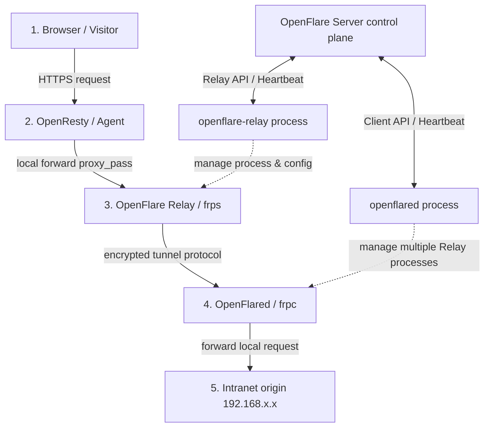

# Tunnel & Intranet Penetration Design

You will learn: the architecture design of OpenFlare's intranet penetration tunnels, the internal principles of the dual-end control components (Relay and Client), interaction logic, and the data-plane / control-plane communication flows.

---

## Requirements Analysis

In typical web-hosting scenarios, many origins are deployed in intranet environments (local dev machines, LAN servers, or firewall-restricted intranet clusters). These servers usually:
1. **Have no public IP**: cannot be directly reached by public traffic.
2. **Compliance restrictions**: port mapping (NAT) on border routers is not freely allowed.
3. **Dynamic IP changes**: traditional DDNS is high-latency and unstable.

To let intranet origins seamlessly join the OpenFlare global data gateway and enjoy value-added services like WAF geo protection and TLS certificate management, OpenFlare designs a **reverse-relay tunnel penetration** solution. In this architecture, public edge nodes act as the reverse-proxy entry and traffic relay; the intranet side only needs outbound secure connections to safely and stably reverse-penetrate public traffic to intranet origins.

---

## Core Features

The intranet penetration subsystem includes:

* **Dynamic Relay node management**: the control plane dynamically dispatches the relay service (frps), dynamically distributing service ports and auth tokens.
* **Multi-tunnel reverse proxy mapping**: map multiple intranet web ports on a single intranet client, binding multi-domain routes to corresponding relay nodes.
* **Independent process lifecycle management**: both relay and client are standalone Go binaries that spawn, monitor, self-heal, and hot-upgrade the underlying frp engines.
* **Token-based auth isolation**: the relay uses `agent_token`; the intranet client uses its dedicated `tunnel_token` — permissions and route boundaries isolated.
* **Config validation and incremental hot reload**: config files are rewritten and processes reloaded only when tunnel bindings, certificates, or Relay topology actually change, reducing runtime overhead.

---

## Tunnel Architecture

The subsystem integrates the mature `frp` high-performance tunnel protocol, split into a **Control Plane** and a **Data Plane**.



* **Control Plane**: the Server maintains DB state; `openflare-relay` on relay nodes and `openflared` on intranet servers sync tunnel config via HTTP heartbeats and WebSocket long channels.
* **Data Plane**: public traffic first enters the public-edge Agent (OpenResty), where HTTPS handshake, TLS termination, and WAF filtering happen; then `proxy_pass` forwards to the same-host `openflare-relay (frps)`. `frps` encapsulates the request and sends it through the persistent tunnel established with the intranet `openflared (frpc)`, which finally unpacks and dispatches to the actual intranet origin.

---

## Relay Design

`openflare-relay` is the relay manager deployed at the public edge, running on `tunnel_relay`-type nodes.

### 1. Core Architecture & Logic
* **Process guard**: the Relay process holds the `frps` binary, spawns `frps -c frps.toml` via `exec.Command`, and starts a goroutine asynchronously watching its exit state. If `frps` exits abnormally, it auto-restarts with backoff.
* **Dynamic config rendering**: syncs state to the control plane via HTTP heartbeat and fetches the current `RelayConfig`, mainly:
  * `bindPort`: frps's public control port listening for intranet frpc client connections.
  * `vhostHTTPPort`: vhost HTTP traffic port; the Agent's proxy_pass points here.
  * `authToken`: security credential for client handshake validation.
  * `webServer`: enables the frps dashboard API; the Relay collects real-time active tunnel counts and traffic metrics from this or the admin control port.
* **State reporting**: each heartbeat reports the underlying `frps` active connections, registered client count, per-proxy real-time state, and Relay version.

---

## Openflared (Client) Design

`openflared` is the client manager on the user's intranet server, authenticated with its dedicated `tunnel_token`.

### 1. Core Mechanisms
* **Multiple Relay support (multiplexing)**:
  for HA or nearest access, the control plane may schedule a client across multiple public Relays. `openflared` reads the Relays list in `TunnelConfig`, generates a dedicated config per Relay locally (named `frpc_<relay_node_id>.toml`), and assigns each Relay process an independent cancelable context.
* **Independent child-process monitoring**:
  `openflared` maintains a `processes` map for per-`frpc` lifecycle management. When the control plane adds or removes a Relay, the client incrementally spawns new processes or gracefully shuts down old ones without affecting other working tunnels.
* **Dynamic TOML generation**:
  when rendering the TOML for each Relay, the client iterates the Proxies list and writes each intranet service's `LocalAddr`, `LocalPort`, and bound `CustomDomains` into `[[proxies]]` blocks.

---

## Interaction Logic and Traffic Model

The subsystem implements consistent versioning and state feedback.

### 1. Control-Plane Release and Sync Flow

```text
Admin modifies tunnel/intranet port mapping -> submit release -> generate new Tunnel version and Checksum
                                            |
                                            v (push or heartbeat pull)
+-------------------------------------------+-------------------------------------------+
|                                                                                       |
v (relay side)                                                                           v (intranet client)
openflare-relay heartbeat detects frps port/Token changes                                openflared heartbeat detects tunnel_version change
re-render local frps.toml                                                                 request latest proxy mapping package
kill and restart the frps process                                                         re-render frpc_<relay_id>.toml
report health state healthy                                                                 restart changed Relay processes with hot reload
                                                                                         report apply result (Apply Success/Error)
```

1. **Versioned control**: tunnel routes and mappings are versioned like the main routing system, dispatching `version` and `checksum` so clients don't rewrite or reload processes redundantly.
2. **Apply-result loop**: after applying new config, the client reports the result in its heartbeat. If frpc can't connect (intranet port unreachable or wrong cert config), the client captures process output and reports `LastError`, letting admins see penetration failure reasons directly in the Server.

### 2. Data-Plane Traffic Model
1. **Public entry (Agent)**:
   ```nginx
   server {
       listen 443 ssl;
       server_name intranet.example.com;
       # ... TLS cert & WAF filtering logic ...
       location / {
           proxy_pass http://127.0.0.1:8080; # points to the local frps vhost port
           proxy_set_header Host $host; # must keep the original Host; frps routes by Host
           proxy_set_header X-Real-IP $remote_addr;
       }
   }
   ```
2. **Relay node (frps)**:
   `frps` receives the HTTP request on the vhost port (default `8080`), reads the `Host: intranet.example.com` header, and looks up the registered active-tunnel table for the matching encrypted TCP connection (established by the intranet frpc).
3. **Encrypted tunnel transport (TCP)**:
   `frps` encapsulates the HTTP request into the internal TCP tunnel protocol and sends it to the intranet `frpc` client.
4. **Intranet client dispatch (frpc)**:
   the `frpc` managed by `openflared` receives the packet, opens a local TCP connection per local config (`localIP = "127.0.0.1"`, `localPort = 8080`), forwards to the intranet web service, and returns the response along the same path to the public user.
