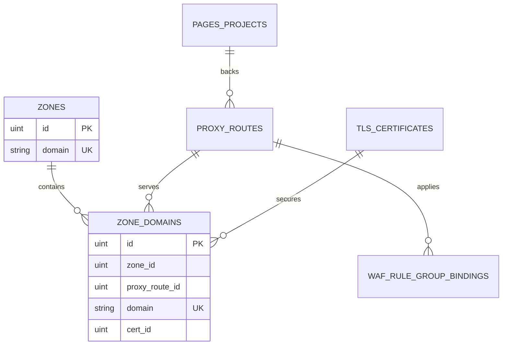

# Zone & Domain Resource Design

## Goals

Refactor "websites" into a Zone management experience keyed by registrable root domains. A Zone like `example.com` is a stable management boundary; users enter the Zone through a stable ID path to view and maintain its explicitly declared domains, the reverse proxy routes and certificates bound to those domains, and route-level WAF, Pages and other capabilities.

This design replaces the concept, tables, and APIs of `managed_domains`. The Zone core does **not** include authoritative DNS record management; to point ZoneDomain A records at edge nodes, use the optional module [Cloudflare DNS Pointing](./cloudflare-pointing.md).

## Scope and Constraints

* Zone root domains are resolved with the Public Suffix List, e.g. `api.example.co.uk` belongs to `example.co.uk`.
* URLs use IDs: list at `/websites`, detail at `/websites/:zoneId`; domains are not used as URL parameters.
* Zone domains must be explicit FQDNs; `*.example.com` is not allowed. TLS certificates may still contain wildcard SANs and cover explicit Zone domains.
* A Zone domain is associated with at most one reverse proxy route; a route may associate with multiple Zone domains, thus sharing the same upstream, cache, rate limit, WAF and Pages config across Zones.
* The Zone model itself adds no DNS records, edge functions, preview subdomains, or tenant isolation. Creating/updating external DNS A records is handled by the separate Cloudflare pointing module and does not change the Zone / ZoneDomain table responsibilities.

## Core Model

### `of_zones`

Stores the root domain, created time, and updated time. Root domains are globally unique and cannot be modified in place after creation; to change one, create a new Zone and migrate the domains. Before deleting a Zone, all of its Zone domains must be cleared first.

### `of_zone_domains`

Stores `zone_id`, explicit `domain`, nullable `proxy_route_id`, nullable `cert_id`, and timestamps. `domain` is globally unique; all relationship fields are indexed but no physical foreign keys are created. `proxy_route_id` may be null to host historical domains that have a certificate prepared but no reverse proxy configured yet.

`of_proxy_routes` gradually removes the domain/certificate redundancy columns `domain`, `domains`, `cert_id`, `cert_ids`, and `domain_cert_ids`. Routes must no longer specify any TLS certificate; the route name `site_name` becomes the stable human-readable identifier, and the compiler reads `server_name` and its `cert_id` from the associated Zone domains. This gives each explicit domain a single certificate source.

## Business and API

New Zone resources in the admin panel:

* `GET/POST /api/v1/d/zones`
* `GET/POST /api/v1/d/zones/:id/update`
* `POST /api/v1/d/zones/:id/delete`
* `POST /api/v1/d/zones/:id/domains` (list returned via overview)
* `POST /api/v1/d/zones/:id/domains/:domainID/update`
* `POST /api/v1/d/zones/:id/domains/:domainID/delete`
* `GET /api/v1/d/zones/:id/overview`

Reverse proxy route create/update requests switch to `zone_domain_ids` and no longer submit `domains`, `cert_id`, `cert_ids`, or `domain_cert_ids`. The server validates domain ownership, global uniqueness, and certificate SAN coverage in a transaction; failures are returned uniformly via `response.Abort*`. Deleting a Zone domain bound to a route requires unbinding or deleting the route first; deleting a Zone that still has domains must be rejected.

WAF, Pages, upstream, and release versions remain part of `proxy_routes`. The Zone overview only aggregates the route state associated with its domains and does not copy or redefine those configs.

## Frontend Experience

`/websites` shows only Zone root domains with configured domain count, route count and status, plus search, create, and action menus. Clicking enters `/websites/:zoneId`.

The detail page includes:

* Overview: domain, route, and valid certificate statistics; domain—route—certificate summary; route-level WAF and Pages summary.
* Domains: a list of explicit FQDNs, certificate selection, and associated routes; wildcard domains are not shown or accepted.
* Routes: routes filtered to the current Zone, linking to existing route details.
* Certificates: certificates actually referenced by the current Zone's domains.
* Settings: Zone notes and a protected delete operation.

When adding a route, select from Zone domains; users can also register domains in the Zone first, then bind a route. The global reverse proxy route entry remains but uses the same Zone domain selector.

## Data Migration

This rework ships in two release phases to avoid SQL using a wrong "last two labels" rule for multi-level public suffixes. Operation details: [Zone Domain Migration and Release Acceptance](../guide/zone-domain-migration.md).

1. **Phase 1 DDL**: PostgreSQL and SQLite goose create `of_zones` / `of_zone_domains` at the same version; `of_managed_domains` and route redundancy columns are temporarily kept.
2. **Data import (automatic)**: at Server startup `migrator.Migrate()` first applies goose SQL up to `202607120002`, then automatically imports legacy route domains / `managed_domains` (registering root domains via `publicsuffix` parsing, writing `cert_id` and `proxy_route_id`), then continues with the remaining SQL. Conflicts fail startup; fixing and restarting retries idempotently. No manual command needed.
3. **Code switch**: control-plane APIs, config snapshots, rendering, and frontend all use Zone domains as the single source; route writes only use `zone_domain_ids`.
4. **Phase 2 cleanup**: goose SQL `202607130001_drop_legacy_route_domain_columns` drops `of_managed_domains` and the `of_proxy_routes` redundancy columns. Down only restores an empty dev-DB structure and does not backfill historical data.

### Runtime Model Boundaries

* Persistence: domains and certificates exist only in `of_zone_domains`; `of_proxy_routes` only stores route policy (upstream, cache, rate limit, WAF binding keys, etc.).
* Rendering: the config snapshot assembles temporary `Domains` / `DomainCertIDs` in memory for OpenResty rendering and does not write back to the database.
* Structure migration only uses `internal/infra/persistence/migrator/goose/{postgres,sqlite}/*.sql`; legacy domains are imported automatically at startup, and after phase 2 the old columns no longer exist so it is a no-op.
