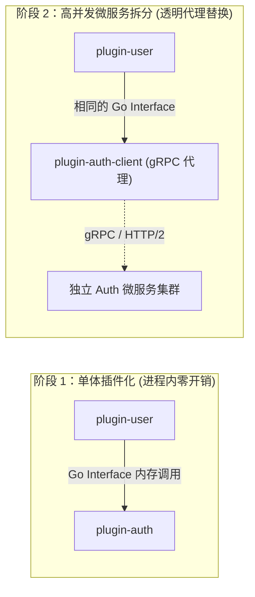

# Wavelet Cordis 微内核与全插件化架构设计规范

- **创建日期**: 2026-08-27
- **状态**: Approved Design
- **架构代号**: Cordis-Wavelet (Next 5-Year Foundation)

---

## 1. 背景与目标

### 1.1 现状与痛点
Wavelet 当前采用中心化显式装配架构（`internal/platform/bootstrap` 与 `internal/router`），业务逻辑集中在 `internal/apps/` 下。
随着业务功能的快速拓展，现有架构暴露出以下瓶颈：
1. **模块高耦合**：新增功能需要横跨多个中心化目录（`apps/`、`router/`、`bootstrap/`、`migrator/`、`task/handlers/`）进行插桩，难以做到随插随用与物理隔离。
2. **下游扩展困难**：二次开发项目无法在不修改核心源码的前提下灵活扩展或替换业务模块。
3. **缺乏清晰的运行切面**：API、Worker、Scheduler 启动模式依赖手动条件判断，维护成本高。

### 1.2 改造核心目标
1. **微内核 (Micro-Kernel)**：内核仅提供上下文总线（Context）、依赖注入（IoC）、生命周期状态机与扩展点协议，内核本身零具体业务依赖。
2. **一切皆插件 (All-in-Plugins)**：数据库、缓存、日志、HTTP 服务、任务处理、认证鉴权、消息网关及业务能力全部以插件形式挂载在 Context 上。
3. **下游一等公民支持**：下游项目通过声明式 `app.Use(&MyPlugin{})` 引入官方或自定义插件，编译为单一高性能二进制文件。
4. **面向未来 5 年的分布式与微服务就绪 (Monolith-First, Microservice-Ready)**：基于强类型接口契约，单体模式下零开销内存调用，高并发下支持透明替换为 gRPC/RPC 客户端插件完成微服务拆分。

---

## 2. 核心架构模型 (Core Architecture)

```
+-----------------------------------------------------------------------------------+
|                        下游业务项目 (Downstream Application)                       |
|           main.go: app.Use(&logger.Plugin{}).Use(&auth.Plugin{})...               |
+-----------------------------------------------------------------------------------+
                                         │
                                         ▼
+-----------------------------------------------------------------------------------+
|                       Wavelet Core (微内核上下文总线)                              |
|   - Context (服务树与扩展点总线)          - Lifecycle Manager (生命周期编排)     |
|   - Service Hub (泛型 IoC 容器)           - EventBus (强类型领域事件总线)        |
+-----------------------------------------------------------------------------------+
         │                                       │
         ▼ 注册与驱动                            ▼ 挂载能力
+------------------------------------+  +-------------------------------------------+
|    运行时驱动插件 (Driver Plugins)  |  |       业务领域插件 (Domain Plugins)       |
|  - driver-http (Gin Web 引擎)      |  |  - plugin-auth (认证/Session/OAuth)       |
|  - driver-worker (Asynq 消费池)     |  |  - plugin-user (用户资料/角色权限)        |
|  - driver-cron (Asynq 定时调度器)  |  |  - plugin-msg-gateway (消息通道与推送)    |
|  - driver-database (GORM 数据源)   |  |  - plugin-risk-control (访问风控与限流)   |
|  - driver-cache (RAM/Redis 缓存)   |  |  - [下游自定义插件] (业务私有插件)        |
+------------------------------------+  +-------------------------------------------+
```

---

## 3. 微内核协议契约与设计规范

### 3.1 插件契约 (`core.Plugin`)
所有官方插件与下游自定义插件均实现统一的 `Plugin` 接口：

```go
package core

import "context"

// Plugin 插件统一契约
type Plugin interface {
    // Name 插件唯一标识（如 "auth", "database", "message_gateway"）
    Name() string
    // Apply 核心装载入口：通过 Context 提供服务、注册路由、声明任务与监听事件
    Apply(ctx *Context) error
}
```

### 3.2 运行时驱动契约 (`core.Driver`)
HTTP 服务、Worker 消费池、Cron 调度器不硬编码在内核中，而是作为标准 `Driver` 挂载：

```go
package core

type DriverType string

const (
    DriverTypeHTTP      DriverType = "http"
    DriverTypeWorker    DriverType = "worker"
    DriverTypeScheduler DriverType = "schedule"
)

// Driver 是具备事件循环或监听端口的运行时引擎
type Driver interface {
    Type() DriverType
    Start(ctx context.Context) error
    Stop(ctx context.Context) error
}
```

### 3.3 Context 统一服务总线与泛型注入
```go
package core

// Provide 向 Context 注册强类型服务实现
func Provide[T any](ctx *Context, service T)

// Inject 从 Context 获取已注册的服务
func Inject[T any](ctx *Context) (T, error)

// Using 声明式依赖注入（当且仅当依赖的服务全部就绪时激活回调）
func Using[T1 any](ctx *Context, fn func(s1 T1)) error
func Using2[T1, T2 any](ctx *Context, fn func(s1 T1, s2 T2)) error
```

---

## 4. 领域扩展点规范 (Domain Extension Points)

微内核提供 6 大标准扩展点，供插件高内聚地声明自己的资源：

### 4.1 HTTP 路由扩展 (`ctx.Router()`)
```go
type RouterExtension interface {
    Group(relativePath string, handlers ...gin.HandlerFunc) *gin.RouterGroup
    Use(middleware ...gin.HandlerFunc)
}
```

### 4.2 数据迁移扩展 (`ctx.Migrations()`)
每个插件通过 Go 内置 `embed.FS` 打包专属的 Goose SQL 文件，彻底消除单体大迁移目录的合并冲突：

```go
type MigrationExtension interface {
    // Register 注册插件专属的 SQL 迁移文件系统
    Register(pluginID string, fsys fs.FS, dir ...string)
}
```

**版本隔离机制**：所有插件共享一张 `w_schema_versions` 表，以 `plugin_id` 列区分。运行时引擎（`gooseEngine`）实现 `goosedb.Store` 接口，对该表执行 `plugin_id` 限定的 CRUD 操作，确保各插件的版本互不干扰。

```sql
w_schema_versions (
    plugin_id   VARCHAR(64)  NOT NULL,
    version_id  BIGINT       NOT NULL,
    applied_at  TIMESTAMPTZ  NOT NULL DEFAULT CURRENT_TIMESTAMP,
    PRIMARY KEY (plugin_id, version_id)
)
```

**启动流程**：
1. `ApplyPlugins()` 阶段：各插件调用 `ctx.Migrations().Register("order", embedFS)` 收集迁移
2. `RunMigrations()` 阶段：引擎遍历所有 `entries`，为每个插件创建 `goose.NewProvider(dialect, sqlDB, entry.FS, goose.WithStore(store))`
3. `provider.Up()` 查询 `w_schema_versions WHERE plugin_id = 'order'` 决定版本，执行增量迁移

### 4.3 异步任务与定时调度扩展 (`ctx.Task()` & `ctx.Schedule()`)
```go
type TaskExtension interface {
    Register(taskType string, handler asynq.HandlerFunc)
}

type ScheduleExtension interface {
    RegisterCron(spec string, taskType string, payload any)
}
```

### 4.4 领域事件总线 (`ctx.Events()`)
用于跨插件完全解耦通信，单机模式走内存通道，集群模式无缝升级为 Redis Stream / NATS：
```go
type EventBus interface {
    On(topic string, handler any)
    Emit(topic string, payload any) error
}
```

### 4.5 动态系统设置扩展 (`ctx.Settings()`)
```go
type SettingExtension interface {
    RegisterSchema(pluginID string, schema any)
}
```

---

## 5. 插件形态与目录布局规范

插件结构遵循 **“扁平 (Flat)、自包含 (Self-Contained)、就近组织 (Colocated)”** 原则，杜绝不必要的 DDD 样板代码。

### 5.1 官方插件目录结构
```text
plugins/
├── database/            # 数据库驱动插件
│   ├── plugin.go        # 注册 DBService 与连接池
│   └── service.go
├── auth/                # 认证插件
│   ├── plugin.go        # 插件装载入口：ctx.Provide[AuthService] + 路由挂载
│   ├── service.go       # AuthService 接口实现 (登录/Token/Session)
│   ├── handlers.go      # HTTP Controller
│   ├── models.go        # GORM 实体定义
│   └── migrations/      # 专属 Goose SQL 迁移
│       └── 001_auth_init.sql
├── message_gateway/     # 消息网关插件
│   ├── plugin.go        # 路由挂载 + Worker 任务注册
│   ├── channels.go      # Telegram / QQ / Webhook 各渠道实现
│   └── models.go
└── [下游自定义插件]/     # 下游业务方自研插件
    ├── plugin.go
    └── models.go
```

---

## 6. 插件间引用关系与协同规范

为杜绝 Go 语言的 `import cycle not allowed` 错误并保持插件的独立可替换性，插件间交互严格遵循以下 3 大模式：

1. **服务槽位与延迟绑定（用于跨插件直接调用）**：
   * 双方互不 import 对方包，仅面向 `core/contracts` 暴露的 Interface 编程。
   * 运行时通过 `core.Inject[contracts.UserService](ctx)` 获取服务。
2. **事件总线广播（用于通知与状态联动）**：
   * 登录成功、密码修改、订单创建等事件统一通过 `ctx.Events().Emit()` 广播，下游自愿监听。
3. **注册表扩展点模式（用于功能插件扩充主插件能力）**：
   * 主插件向 Context 提供注册表（如 `OAuthProviderRegistry`），扩充插件在 `Apply` 中向注册表添加自己的 Provider 实现。

---

## 7. 运行切面与启动路径 (Runtime Profiles)

CLI 命令仅作为**切面激活器 (Target Selector)**，业务插件无需感知当前的运行角色：

```
[CLI: wavelet api / worker / schedule / all]
     ↓
1. App Bootstrap: 加载所有已配置插件并构建 Context
     ↓
2. Apply Phase: 执行所有 plugin.Apply(ctx)，收集路由、任务、调度与迁移
   └─ 各插件调用 ctx.Migrations().Register("auth", authMigrations) 等
     ↓
3. Migration Engine: 遍历所有 entries，逐插件创建 Goose Provider 执行迁移
   └─ 每个插件使用独立的 sharedStore(pluginID)，共享同一张 w_schema_versions 表
   └─ provider.Up() 检查 w_schema_versions WHERE plugin_id = 'auth'
   └─ 未执行过 → 执行 00001_initial.sql → INSERT 版本记录
   └─ 已执行过 → 跳过
     ↓
4. Profile Dispatch:
   - "api": 激活 DriverTypeHTTP 驱动 (Gin.ListenAndServe)
   - "worker": 激活 DriverTypeWorker 驱动 (Asynq.Run)
   - "schedule": 激活 DriverTypeScheduler 驱动 (Asynq.Scheduler)
   - "all": 激活所有 Driver 实例 (单体一键融合启动)
     ↓
5. Graceful Shutdown: 监听系统信号，逆序安全停机
```

---

## 8. 面向未来 5 年的分布式与服务拆分演进



1. **接口不变性 (Contract Stability)**：所有跨模块调用走 Interface，微服务化拆分时只需引入 RPC 客户端插件替换原插件，调用方业务代码 **0 修改**。
2. **分布式事件驱动**：进程内 EventBus 通过简单配置可无缝切换为 Redis Stream / NATS / Kafka。
3. **独立数据分片**：每个插件表名自带命名空间（如 `w_auth_*`），且有独立 Migration，天然支持物理分库分表。

---

## 9. 渐进式改造实施路线图

1. **Phase 1: 微内核基础设施搭建 (`core/` & `core/contracts/`)**
   - 实现 Context、泛型 IoC 容器、生命周期状态机与 6 大扩展点协议。
2. **Phase 2: 运行时驱动插件下沉 (`plugins/driver_*`)**
   - 将现有 Gin、Asynq Worker、Asynq Scheduler、GORM、Redis 封装为标准 Driver 插件。
3. **Phase 3: 官方领域模块插件化拆分 (`plugins/domain_*`)**
   - 依次将 `auth`、`user`、`message_gateway`、`risk_control`、`admin` 迁移为标准插件。
4. **Phase 4: 下游工程脚手架与验证**
   - 提供下游开发模板，编写示例自定义插件，端到端验证 API/Worker/Schedule 运行切面与测试覆盖。
