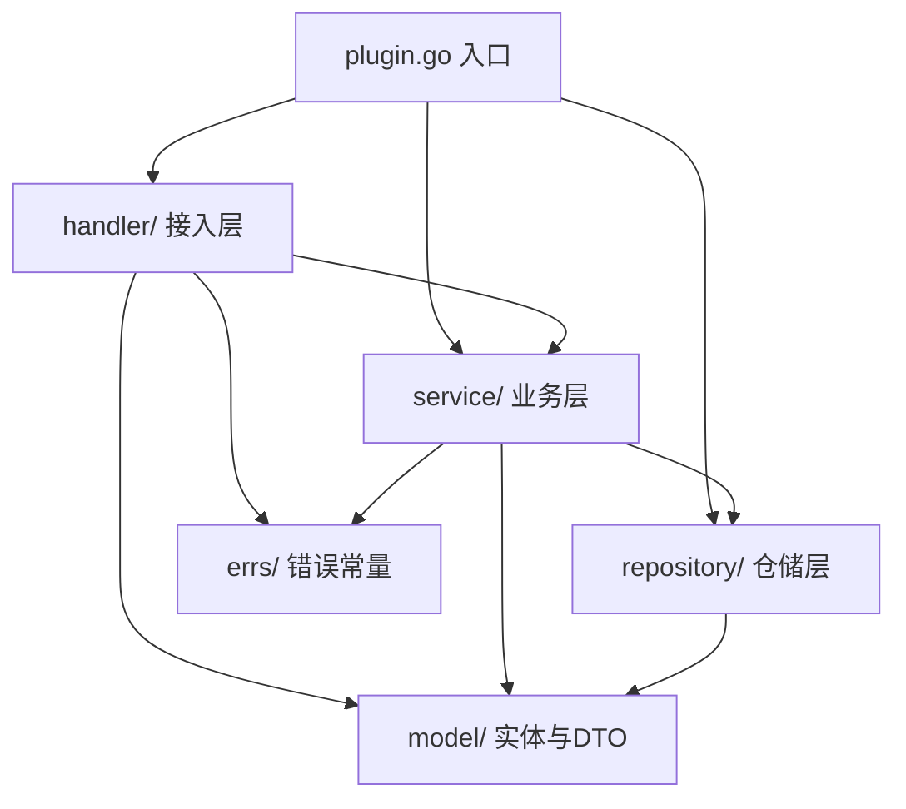

# Cordis 架构插件标准分层设计规范 (Plugin Layered Architecture Spec)

- **文档状态**: 已敲定 (Approved)
- **版本**: v1.1.0 (2026-08-28)
- **适用范围**: Wavelet 官方插件 (`backend/plugins/`)、下游定制插件 (`downstream/custom_plugins/`)

---

## 1. 架构总览与分型原则 (Architecture & Selection Strategy)

在 Wavelet 的 Cordis 微内核架构中，系统通过 **微内核 (`core/`) + 服务契约 (`core/contracts/`) + 自包含插件 (`plugins/`)** 实现高度解耦与单向依赖。
为了规范插件内部代码组织，插件遵循 **标准分层架构（Layered Architecture / MVC 变体）**，并根据业务复杂度提供两套标准物理包结构：

| 模式 | 适用场景 | 复杂度特征 | 物理结构形式 | 命名规范核心禁令 |
| :--- | :--- | :--- | :--- | :--- |
| **模式 1：极简单文件自包含**<br>(Single-File Flat) | 极简微型插件 | 仅有 1 个单一实体、代码量 < 500 行（如极简工具、Demo） | 单 Package，每个层级仅对应 1 个同名文件 (`handlers.go`, `service.go`, `models.go`, `repository.go`) | **严禁在根目录平铺 `handlers_*`、`service_*` 等前缀文件** |
| **模式 2：独立子包分层架构**<br>(Strict Sub-packages) | 标准/中大型业务插件（**官方推荐标准**） | 包含多实体/多接口、代码量 ≥ 500 行（如 `upload`, `auth`, `admin`, `order` 等） | 严格按层独立子包 (`handler/`, `service/`, `repository/`, `model/`, `errs/`) | **子包内文件直接以业务命名（如 `user.go`, `config.go`），禁止带 `handler_*` / `service_*` 前缀** |

---

## 2. 模式 1：极简单文件自包含规范 (Single-File Flat Package)

仅适用于极简小型插件（整个插件代码极少且各层只有一个文件）。

### 2.1 目录结构
```text
backend/plugins/domain/<plugin_name>/
├── plugin.go           # [Cordis 接入层] 实现 core.Plugin，负责 Apply 组装与扩展点注册
├── handlers.go         # [Handler 层] 单一文件：Gin API Handler
├── service.go          # [Service 层] 单一文件：核心业务用例
├── repository.go       # [Repository 层] 单一文件：GORM / DB 操作
├── models.go           # [Model 层] 单一文件：实体与 DTO
├── errs.go             # [Error 层] 单一文件：错误常量
├── plugin_test.go      # 插件测试
└── migrations/         # Goose SQL 嵌入文件
    └── 20260828000001_init_<plugin_name>.sql
```

> ⚠️ **严禁规则**：当单一文件膨胀或需要拆分多个业务实体时，**严禁在根目录创建 `handlers_user.go`, `handlers_admin.go`, `service_user.go` 等前缀文件**，必须立即重构并迁移为 **模式 2（独立子包分层架构）**！

---

## 3. 模式 2：标准独立子包分层架构 (Standard Sub-package Architecture - 推荐规范)

适用于绝大多数业务插件。各层使用独立的 Go package 物理隔离，**在子包内以纯业务实体命名文件**。

### 3.1 目录结构与文件命名规约
```text
backend/plugins/domain/<plugin_name>/
├── plugin.go              # [插件根入口] 实现 core.Plugin，装配各子包并向 Cordis 注册
│
├── handler/               # package handler：HTTP API 接入层（或 controller/）
│   ├── router.go          # 路由组挂载与中间件绑定
│   ├── auth.go            # 认证相关 Handler（直接命名为 auth.go，禁止 handlers_auth.go）
│   ├── user.go            # 用户相关 Handler（直接命名为 user.go，禁止 handlers_user.go）
│   ├── config.go          # 配置相关 Handler（直接命名为 config.go，禁止 handlers_config.go）
│   └── logs.go            # 日志相关 Handler（直接命名为 logs.go，禁止 handlers_logs.go）
│
├── service/               # package service：核心领域业务逻辑层
│   ├── service.go         # 顶层 Service 组合与构造工厂
│   ├── auth.go            # 认证业务逻辑（直接命名为 auth.go，禁止 service_auth.go）
│   ├── user.go            # 用户业务逻辑（直接命名为 user.go，禁止 service_user.go）
│   ├── config.go          # 配置业务逻辑（直接命名为 config.go，禁止 service_config.go）
│   └── logs.go            # 日志业务逻辑（直接命名为 logs.go，禁止 service_logs.go）
│
├── repository/            # package repository：数据访问持久化层 (DAL)
│   ├── repository.go      # 仓储通用方法与工厂
│   ├── user.go            # 用户仓储实现（直接命名为 user.go，禁止 repository_user.go）
│   ├── config.go          # 配置仓储实现（直接命名为 config.go，禁止 repository_config.go）
│   └── log.go             # 日志仓储实现（直接命名为 log.go，禁止 repository_log.go）
│
├── model/                 # package model (或 models/)：纯领域实体与传输对象
│   ├── entity.go          # 数据库映射实体 (TableName() 必须带 w_<plugin>_ 前缀)
│   ├── dto.go             # 请求入参与响应出参 DTO
│   └── events.go          # 插件内部/广播事件结构体定义
│
├── errs/                  # package errs：错误常量与错误码定义 (或根目录 errs.go)
│   └── errs.go
│
└── migrations/            # Goose SQL 独立迁移嵌入文件 (//go:embed)
    └── 20260828000001_init_<plugin_name>.sql
```

### 3.2 依赖方向约束 (Strict Dependency Flow)

* **单向依赖铁律**：
  1. `handler/` 依赖 `service/`、`model/`、`errs/`；
  2. `service/` 依赖 `repository/`、`model/`、`errs/`，**严禁 import gin**；
  3. `repository/` 依赖 `model/` 和数据库底层，**严禁反向依赖 service 或 handler**；
  4. `model/` 纯粹由 Go 结构体组成，**严禁依赖上层 handler/service/repository**。

---

## 4. 各层职责边界与编码守则 (Layer Responsibilities & Guardrails)

### 4.1 Handler 层 (`handler/`)
1. **参数绑定**：使用 `c.ShouldBindJSON` 或 `c.ShouldBindQuery`。
2. **上下文提取**：从 `*gin.Context` 提取登录态（如 `oauth.GetCurrentUser(c)`）。
3. **调用下游**：调用 Service 方法，禁止直接调用 Repository 或编写 SQL。
4. **统一信封响应**：
   - 成功：`c.JSON(http.StatusOK, response.OK(data))` 或 `response.OKNil()`。
   - 失败：使用 `backend/pkg/response` 的 `Abort*` 系列函数（如 `AbortBadRequest`、`AbortUnauthorized`、`AbortNotFound`、`AbortInternal`）。
5. **Swagger 注释**：每个导出 Handler 必须编写完整的 OpenAPI/Swagger 注解。

### 4.2 Service 层 (`service/`)
1. **纯 Go 逻辑**：第一参数必须为 `ctx context.Context`，返回 `(result, error)`。
2. **禁止依赖 Web 框架**：严禁 import `github.com/gin-gonic/gin`，严禁接收 `*gin.Context`，严禁调用 `c.JSON`/`Abort*`。
3. **事务编排**：涉及插件内多表原子操作时，通过 `ctx.DB().Transaction(...)` 编排。
4. **事件驱动解耦**：跨插件业务通知与状态联动统一通过 `ctx.Events().Emit(...)` 广播领域事件，杜绝直接跨插件调用私有方法。

### 4.3 Repository 层 (`repository/`)
1. **GORM / SQL 操作**：统一接收 `context.Context`，通过 `db.WithContext(ctx)` 操作数据。
2. **SQL LIKE 防注入**：所有含用户输入的模糊查询必须调用 `backend/pkg/util.EscapeLike` 并显式声明 `ESCAPE '\\'`。
3. **表单一所有者原则**：仅操作本插件所属表（前缀 `w_<plugin>_*`），严禁越权 DML/DDL 其他插件所有表。

### 4.4 Model 层 (`model/` 或 `models/`)
1. **GORM 映射**：显式实现 `TableName() string` 返回带前缀表名。
2. **零值对齐**：Go 结构体字段零值必须与数据库默认值匹配。
3. **无物理外键**：禁止物理外键约束，显式建立单列/复合索引。

### 4.5 Plugin 入口 (`plugin.go`)
1. 实现 `core.Plugin` 接口（`Name() string` 与 `Apply(ctx *core.Context) error`）。
2. 在 `Apply` 中完成：
   - 依赖注入与解析（`core.Provide` / `core.Inject` / `ctx.Using`）
   - 路由与中间件声明（`ctx.Router().Group(...)`）
   - 异步与定时任务注册（`ctx.Task().Register` / `ctx.Schedule().RegisterCron`）
   - 配置与设置声明（`ctx.Settings().Register` / `ctx.Config().Bind`）
   - 数据库迁移注册（`ctx.Migrations().Register`）
